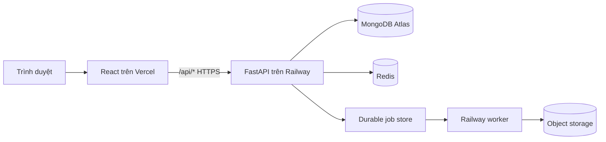
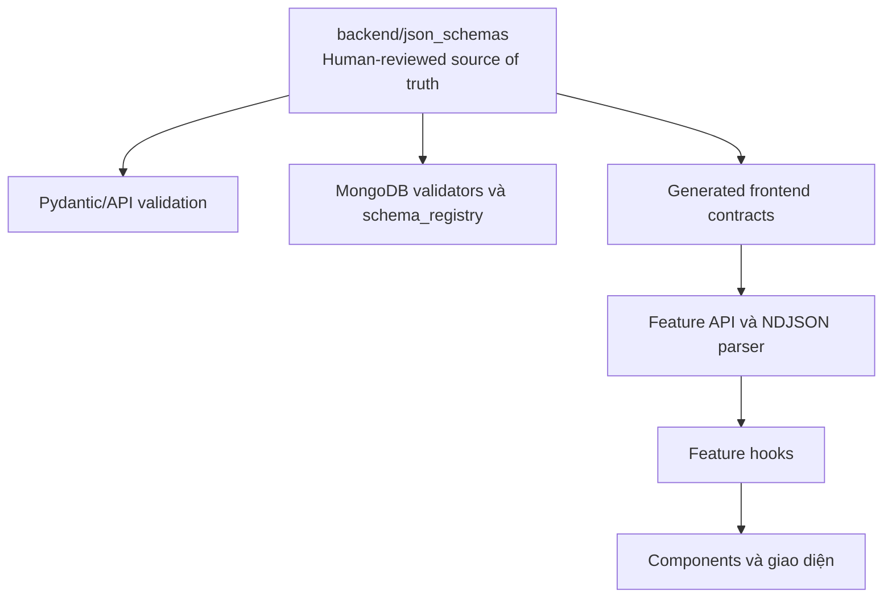

# HUIT Admissions AI Chatbot

Trợ lý AI tư vấn tuyển sinh cho Trường Đại học Công Thương TP.HCM (HUIT), hỗ trợ hỏi đáp RAG, tra cứu ngành học/học phí/điểm chuẩn, phát trực tuyến JSON, tạo tài liệu và quản trị vận hành.

## Truy cập hệ thống

| Thành phần | Địa chỉ | Trạng thái |
|---|---|---|
| Giao diện người dùng | [huit-chatbot.vercel.app](https://huit-chatbot.vercel.app) | Công khai |
| Trang quản trị | [huit-chatbot.vercel.app/admin](https://huit-chatbot.vercel.app/admin) | Yêu cầu tài khoản quản trị |
| Frontend | Vercel | Đang hoạt động |
| API và worker | Railway containers | Đang hoạt động |
| Dữ liệu | MongoDB Atlas, Redis và object storage | Cấu hình bằng biến môi trường |

> Tài khoản, mật khẩu, API key và chuỗi kết nối không được lưu trong Git hoặc README. Trang quản trị nhận thông tin đăng nhập từ secret của môi trường triển khai.

## Trạng thái đã kiểm chứng

Lần kiểm chứng gần nhất: **19/09/2026**.

- Trang công khai trả về HTTP 200 và không yêu cầu đăng nhập Vercel.
- Khởi tạo phiên qua `POST /api/auth/session` thành công.
- Chat sử dụng NDJSON protocol v2, kết thúc bằng sự kiện `done`.
- Hàng đợi/worker xử lý artifact; trạng thái artifact đạt `ready` và bản xem trước trả về HTTP 200.
- Đăng nhập trang quản trị bằng HttpOnly cookie hoạt động.
- Backend: **243 tests passed**.
- Frontend: **96 tests passed** trên 13 test files.
- Contract/schema gate: **31 tests passed** trên 4 test files.
- Oxlint: **0 errors**, còn 2 cảnh báo không chặn build.
- Vite production build thành công; bundle chính khoảng **138,38 kB gzip**, CSS khoảng **8,64 kB gzip**.

Đây là bản **public demo/staging đang hoạt động**. Việc nghiệm thu production thương mại vẫn cần hoàn tất các mục bảo mật hạ tầng, giám sát, tải thực tế và quy trình phát hành ở phần cuối tài liệu.

## Tính năng chính

- RAG tuyển sinh HUIT với hybrid retrieval, reranking và trích dẫn nguồn.
- Multi-provider LLM fallback: Gemini, Groq và OpenRouter.
- JSON/NDJSON streaming v2 có sequence, resume và cancel.
- Tạo và quản lý artifact; export Word/Excel/PDF và upscale chạy qua durable worker.
- Deduplication tách physical asset khỏi quyền sở hữu của từng người dùng.
- Lịch sử hội thoại, giọng nói STT/TTS, lightbox và giao diện responsive.
- Trang quản trị cho health, jobs, workers, logs và trạng thái hệ thống.
- Rate limiting, CSRF, HttpOnly session cookie và phân quyền quản trị.

## Kiến trúc triển khai



- **Frontend:** React 19, TypeScript, Vite; Vercel phục vụ SPA và proxy `/api/*` đến backend thật.
- **Backend:** FastAPI chạy trong container dài hạn; không chạy toàn bộ API/worker trên Vercel Serverless.
- **Worker:** tiến trình riêng cho export, upscale và công việc nặng.
- **Persistence:** MongoDB Atlas cho dữ liệu nghiệp vụ/schema registry; Redis cho cache/coordination; binary lớn nằm trong object storage.
- **Streaming:** reverse proxy phải tắt buffering cho NDJSON và không để SPA fallback nuốt `/api/*`.

## JSON Schema là nguồn chuẩn cho các contract trọng yếu

Schema do con người duyệt nằm tại [`backend/json_schemas/`](backend/json_schemas/README.md). Hiện hệ thống có 6 canonical schemas cho các ranh giới trọng yếu: chat request, session bootstrap, stream event v2, legacy stream boundary, operation audit và schema registry record.



- `backend/app/contracts/schema_registry.py`: nạp schema, kiểm tra đường dẫn và tính SHA-256.
- `scripts/sync_json_schemas.py`: đồng bộ các contract được frontend sử dụng; không sửa bản sinh ra bằng tay.
- `frontend/src/shared/contracts/`: kiểm tra dữ liệu runtime trước khi hook cập nhật UI.
- `scripts/migrations/022_backup_json_schema_registry.py`: backup bản có version vào MongoDB collection `schema_registry`.
- Contract tests chặn release khi schema chuẩn, frontend copy, manifest hoặc MongoDB registry bị lệch.
- Các hook hiện được tổ chức theo feature trong `frontend/src/features/*/hooks`; việc tạo facade hook cấp cao ở root được tách thành hạng mục kiến trúc sau.

> Phạm vi schema-first hiện bảo vệ các contract trọng yếu nêu trên, chưa bao phủ mọi model admin, artifact, job và image. Không tuyên bố toàn hệ thống đã schema-first cho đến khi các contract còn lại được bổ sung và có release gate tương ứng.

## Cấu trúc dự án

```text
chatbot2/
├── backend/
│   ├── json_schemas/              # Canonical JSON Schemas - đọc trước tiên
│   ├── app/
│   │   ├── contracts/             # Registry/loader/checksum của schema
│   │   ├── api/                   # Routes và Pydantic API models
│   │   ├── data_access/           # LTX Registered Operations Gateway
│   │   ├── rag/                   # Retrieval, reranking và generation
│   │   ├── services/              # Artifact, asset, job, visual và image
│   │   ├── repositories/          # MongoDB repositories và indexes
│   │   └── telemetry/             # Request ID, metrics và structured logs
│   └── tests/
├── frontend/
│   ├── src/
│   │   ├── app/                   # App shell và routing
│   │   ├── features/              # Chat, admin, history, voice, artifact...
│   │   ├── shared/contracts/      # Generated/runtime frontend contracts
│   │   └── styles/                # Design tokens và CSS theo feature
│   └── tests/
├── scripts/
│   ├── migrations/                # MongoDB migrations và schema backup
│   └── sync_json_schemas.py       # Đồng bộ schema sang frontend
├── deploy/                        # Reverse proxy/container configuration
├── docs/                          # Kiến trúc, code map và release reports
├── docker-compose.yml             # Local full stack
├── docker-compose.prod.yml        # Container deployment contract
├── Dockerfile                     # FastAPI image
├── Dockerfile.worker              # Worker image
├── Dockerfile.frontend            # Frontend/Nginx image
└── vercel.json                    # Một cấu hình Vercel chính ở root
```

Xem [`docs/CODE_MAP.md`](docs/CODE_MAP.md) để biết lỗi thuộc thư mục nào và nên sửa ở đâu.

## Chạy cục bộ

### Yêu cầu

- Python 3.10+
- Node.js 20+
- MongoDB/Redis cục bộ hoặc URI của môi trường phát triển

Không commit `.env`. Tạo tệp cục bộ từ mẫu rồi điền secret của riêng môi trường:

```powershell
Copy-Item .env.example .env
pip install -r requirements.txt
npm --prefix frontend install
```

Chạy backend:

```powershell
python -m uvicorn backend.app.main:app --host 0.0.0.0 --port 8000 --reload
```

- API docs: `http://localhost:8000/docs`
- Liveness: `http://localhost:8000/health/live`
- Readiness: `http://localhost:8000/health/ready`

Chạy frontend:

```powershell
npm --prefix frontend run dev
```

Mở `http://localhost:3000`. Vite proxy `/api/*` và `/static/*` sang `http://localhost:8000`.

Hoặc chạy full stack bằng Docker:

```powershell
docker compose up --build
```

## Kiểm thử và release gates

```powershell
# Backend
python -m pytest backend/tests -q
python -m compileall backend scripts

# Frontend
npm --prefix frontend run test
npm --prefix frontend run lint
npm --prefix frontend run build

# Đồng bộ canonical schemas trước khi sửa consumer
python scripts/sync_json_schemas.py --check
```

Unit tests mặc định dùng mock và không thay thế smoke test trên hạ tầng thật. Trước khi phát hành, phải kiểm tra tối thiểu:

1. `GET /health/live` và `GET /health/ready`.
2. `POST /api/auth/session` qua chính URL Vercel.
3. Chat stream nhận đúng event v2 và kết thúc bằng `done`.
4. Job được worker claim, heartbeat và hoàn thành.
5. Artifact đạt `ready`; preview/export/upscale tải được và đúng quyền sở hữu.
6. Admin login, session TTL, CSRF và role checks.

## MongoDB và migrations

- Database nghiệp vụ: `huit_chatbot`.
- `assets` giữ metadata physical blob; `artifacts` giữ ownership và business metadata.
- File lớn không được nhét vào JSON/Base64 trong MongoDB; chỉ lưu metadata và object key.
- `schema_registry` lưu bản backup versioned của canonical schema; Git vẫn là nguồn chỉnh sửa chính.
- Validators dùng `validationLevel: strict` và `validationAction: error` cho các collection đã migrate.
- Migration phải chạy `--dry-run`, backup, apply, verify rồi mới cleanup/rollback window.

Tài liệu chi tiết:

- [`docs/MONGODB_SCHEMA.md`](docs/MONGODB_SCHEMA.md)
- [`docs/MONGODB_MIGRATIONS.md`](docs/MONGODB_MIGRATIONS.md)
- [`docs/ARTIFACT_PIPELINE.md`](docs/ARTIFACT_PIPELINE.md)

## Bảo mật và cấu hình

- Tất cả secret chỉ tồn tại trong environment variables/secret manager của Vercel, Railway và MongoDB Atlas.
- Không ghi tài khoản quản trị, Bearer token, API key hoặc database URI vào mã nguồn/log client.
- MongoDB user chỉ cấp quyền tối thiểu `readWrite` trên database ứng dụng; Redis/MongoDB không mở public port nếu không cần.
- CORS production chỉ cho phép đúng origin Vercel hiện tại và domain chính thức khi có.
- Secret từng xuất hiện trong Git phải được rotate; xóa khỏi file hiện tại không làm nó biến mất khỏi lịch sử Git.

Danh sách biến đầy đủ và giá trị mẫu an toàn nằm trong [`.env.example`](.env.example).

## Triển khai và mức sẵn sàng phát hành

Luồng triển khai hiện tại:

1. PR/merge vào nhánh phát hành sau khi CI đạt.
2. Railway build và triển khai backend/worker từ Dockerfile tương ứng.
3. Chỉ khi backend readiness đạt mới để Vercel proxy `/api/*` đến backend HTTPS thật.
4. Vercel build React và cập nhật alias `huit-chatbot.vercel.app`.
5. Chạy smoke test end-to-end qua URL công khai, không chỉ gọi trực tiếp Railway.

| Mức | Quyết định hiện tại | Điều kiện |
|---|---|---|
| Local development | GO | Tests/build đạt |
| Public demo/staging | GO có điều kiện | Hạ tầng ngoài và quota có thể ảnh hưởng tính sẵn sàng |
| Production thương mại | CHƯA NGHIỆM THU | Cần xác nhận rotation/lịch sử secret, private network, persistent storage, monitoring/alerts, load test và QA đa thiết bị |

Không cần mua domain riêng để chạy bản hiện tại. Chỉ gắn domain chính thức sau khi staging ổn định và các release gate production đã đạt.

## Tài liệu vận hành

- [`docs/ARCHITECTURE.md`](docs/ARCHITECTURE.md)
- [`docs/CODE_MAP.md`](docs/CODE_MAP.md)
- [`docs/DEPLOYMENT_AND_DOMAIN_STRATEGY.md`](docs/DEPLOYMENT_AND_DOMAIN_STRATEGY.md)
- [`docs/ERROR_CODES.md`](docs/ERROR_CODES.md)
- [`docs/PERFORMANCE.md`](docs/PERFORMANCE.md)
- [`docs/FULL_STAGING_RELEASE_GATE_REPORT_2026-09-17.md`](docs/FULL_STAGING_RELEASE_GATE_REPORT_2026-09-17.md)

---

Tài liệu này mô tả trạng thái đã kiểm chứng, không thay thế kết quả CI, smoke test hoặc phê duyệt release của từng môi trường.
