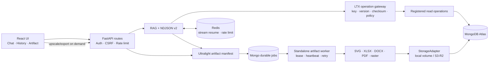

# KIẾN TRÚC TỔNG THỂ HỆ THỐNG HUIT CHATBOT (ARCHITECTURE SPECIFICATION)

Dự án HUIT Chatbot là hệ thống trợ lý AI tư vấn tuyển sinh và tạo tài nguyên đa phương tiện cho Trường Đại học Công Thương TP.HCM (HUIT). Kiến trúc được xây dựng theo chuẩn **Clean Modular Architecture** cho Backend (FastAPI) và **Feature-Based Architecture** cho Frontend (React 19 + TypeScript).

---

## 1. Triết Lý Thiết Kế: "Mô Tả Nhẹ – Dựng Nội Dung Khi Cần" (Lightweight Manifest – Render On-Demand)

Thay vì sinh trực tiếp các file ảnh raster độ phân giải cao hoặc file văn bản/bảng tính nặng gây tốn kém token và tài nguyên máy chủ:
1. **Chatbot phản hồi văn bản trước**: Ưu tiên phát nội dung sớm; cache-hit đo được dưới 2ms. TTFT của truy vấn live còn phụ thuộc MongoDB và nhà cung cấp LLM nên không cam kết cứng dưới 300ms.
2. **Kế hoạch Manifest siêu nhỏ (Ultralight JSON Manifest)**: Chỉ lưu trữ cấu trúc, dữ liệu sạch và style tham số. Kích thước JSON luôn dưới 32KB và tuyệt đối không nhúng Base64 lớn.
3. **Xem trước tức thì bằng Vector SVG**: Vector SVG nhẹ (< 4KB), tải tức thì (< 15ms), sắc nét tuyệt đối trên mọi độ phân giải.
4. **Render file nặng theo yêu cầu (On-Demand)**: File Excel (`.xlsx`), Word (`.docx`), PDF (`.pdf`), hoặc ảnh Upscale (2x, 4x) chỉ được sinh ra khi người dùng chủ động nhấn nút tải hoặc phóng to.
5. **Chống sinh trùng lặp (Deduplication) & Concurrency Lock**: Mã hash chuẩn hóa (Canonical Hash) giúp tái sử dụng tài nguyên đã sinh và khóa `asyncio.Lock` per-hash ngăn chặn race condition khi nhiều người dùng gửi yêu cầu giống nhau cùng lúc.

---

## 2. Sơ Đồ Kiến Trúc Khối (System Architecture Diagram)

---

## 3. Các Phân Hệ Chính (Subsystems)

### 3.1. Phân Hệ Giao Diện Người Dùng (Frontend Layer)
- **Vị trí**: `frontend/src/`
- **Công nghệ**: React 19, TypeScript, Vite, Marked, DOMPurify, Lucide-React.
- **Trách nhiệm**:
  - `features/chat/`: Phát luồng thời gian thực NDJSON, đệm token 35ms mượt mà, phân tách lịch sử phiên an toàn.
  - `features/admission-visuals/`: Hiển thị thẻ Artifact linh hoạt, tích hợp các nút xem trước SVG, tải file Word, Excel, PDF và popup Lightbox.
  - App shell responsive có drawer lịch sử truy cập được bằng bàn phím, trạng thái online/offline, dark/light theme, thao tác nhanh và empty-state theo nhận diện HUIT.
  - `observability/`: Giám sát Content TTFT và độ trễ render client.

### 3.2. Phân Hệ Điều Phối & RAG (Core Backend & Pipeline)
- **Vị trí**: `backend/app/rag/`, `backend/app/services/`
- **Công nghệ**: Python 3.11+, FastAPI, Pydantic v2.
- **Trách nhiệm**:
  - `pipeline.py`: Xử lý RAG hybrid (Vector search 1024D FastEmbed + Keyword search + Heuristic Reranker).
  - `artifact_intent.py`: Nhận diện câu lệnh sinh file hoặc chủ đề cần minh họa (học phí, điểm chuẩn).
  - `artifact_service.py`: Lập kế hoạch manifest, điều phối render, upscale và export.
  - `data_access/operation_gateway.py`: Cổng thực thi LTX duy nhất cho các truy vấn MongoDB đã đăng ký; kiểm tra key/version/checksum, schema tham số, principal, budget và audit trước khi gọi repository.

### 3.3. Phân Hệ Quản Lý Tài Nguyên & Deduplication (Asset Store & Storage)
- **Vị trí**: `backend/app/services/asset_store.py`, `backend/app/storage/storage_adapter.py`, `backend/app/models/mongo_models.py`
- **Trách nhiệm**:
  - **Phân tách Blob & Quyền sở hữu**: Tách riêng `MongoAssetRecord` (Physical Blob cho file nhị phân) và `MongoArtifactRecord` (Logical Ownership & Manifest) để loại trừ triệt để nguy cơ rò rỉ tài nguyên riêng tư khi deduplication toàn cục.
  - Tính SHA-256 Canonical Hash từ `(prompt, template_id, content, style, renderer_version)`.
  - Bộ nhớ đệm 2 cấp: RAM (0ms) $\rightarrow$ MongoDB Atlas collection `assets`.
  - Tự động tăng `reference_count` khi tái sử dụng tài nguyên cũ.
  - Cơ chế khóa `asyncio.Lock` per-hash chống race condition đồng thời.
  - Quản lý file vật lý an toàn qua `StorageAdapter` (`LocalStorageAdapter` cho development và `ObjectStorageAdapter` cho production), tuyệt đối không phụ thuộc vào filesystem tạm thời của Vercel và triệt tiêu nguy cơ Path Traversal.

### 3.4. Phân Hệ Dựng Tài Liệu (Renderer Engines)
- **SVG Engine** ([visual_service.py](../backend/app/services/visual_service.py)): Dựng biểu đồ, bảng giá, thẻ ngành và sơ đồ tuyển sinh vector siêu nét.
- **Word Engine** ([docx_renderer.py](../backend/app/services/docx_renderer.py)): Dựng file `.docx` với nhận diện thương hiệu HUIT, bảng có màu chủ đạo xanh hoàng gia `#0066C4`.
- **Excel Engine** ([visual_service.py](../backend/app/services/visual_service.py)): Dựng file `.xlsx` định dạng đầy đủ tiêu đề, viền ô, căn lề và co giãn cột tự động.
- **PDF Engine** ([pdf_renderer.py](../backend/app/services/pdf_renderer.py)): Dựng file `.pdf` có hỗ trợ font tiếng Việt Unicode, tiêu đề trang và đánh số chân trang.
- **Upscale Engine**: Phóng to ảnh raster lên 2x, 4x bằng Pillow theo yêu cầu.

### 3.5. Phân Hệ Quản Lý Tác Vụ Nền (Background Job Queue)
- **Vị trí**: `backend/app/services/job_queue.py`, `backend/app/workers/artifact_worker.py`
- **Trách nhiệm**:
  - Quản lý các công việc render nặng dưới dạng durable background tasks với MongoDB Lease Queue.
  - Cung cấp cơ chế retry an toàn tối đa 3 lần cho các lỗi retryable.
  - Production dùng worker độc lập; in-process worker chỉ được dùng trong development/test.
  - Cung cấp API `GET /api/jobs/{id}` để client theo dõi tiến trình (`queued` $\rightarrow$ `processing` $\rightarrow$ `completed` / `failed` / `cancelled`).

### 3.6. Phân Hệ Bảo Mật, Lỗi & Telemetry
- **Mã lỗi tập trung**: [backend/app/telemetry/errors.py](../backend/app/telemetry/errors.py) với cấu trúc `ArtifactException` phân loại rõ nguồn gốc, stage, module và request_id.
- **Bảo mật startup**: [backend/app/config.py](../backend/app/config.py) xác thực bắt buộc các biến môi trường bảo mật khi môi trường khác `development`.
- **Bảo mật thông tin riêng tư**: [metrics.py](../backend/app/telemetry/metrics.py) không bao giờ lưu văn bản thô của câu hỏi người dùng lên server log, chỉ lưu mã hash SHA-256 và độ dài.
