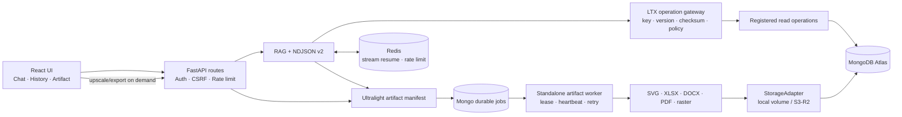

# KIẾN TRÚC TỔNG THỂ HỆ THỐNG HUIT CHATBOT (ARCHITECTURE SPECIFICATION)

Dự án HUIT Chatbot là hệ thống trợ lý AI tư vấn tuyển sinh và tạo tài nguyên đa phương tiện cho Trường Đại học Công Thương TP.HCM (HUIT). Kiến trúc được xây dựng theo chuẩn **Clean Modular Architecture** cho Backend (FastAPI) và **Feature-Based Architecture** cho Frontend (React 19 + TypeScript).

---

## 1. Triết Lý Thiết Kế: "Mô Tả Nhẹ – Dựng Nội Dung Khi Cần" (Lightweight Manifest – Render On-Demand)

Thay vì sinh trực tiếp các file ảnh raster độ phân giải cao hoặc file văn bản/bảng tính nặng gây tốn kém token và tài nguyên máy chủ:
1. **Chatbot phản hồi văn bản trước**: Ưu tiên phát nội dung sớm; cache-hit đo được dưới 2ms. TTFT của truy vấn live còn phụ thuộc MongoDB và nhà cung cấp LLM nên không cam kết cứng dưới 300ms.
2. **Kế hoạch Manifest siêu nhỏ (Ultralight JSON Manifest)**: Chỉ lưu trữ cấu trúc, dữ liệu sạch và style tham số. Kích thước JSON luôn dưới 32KB và tuyệt đối không nhúng Base64 lớn.
3. **Xem trước tức thì bằng Vector SVG**: Vector SVG nhẹ (< 4KB), tải tức thì (< 15ms), sắc nét tuyệt đối trên mọi độ phân giải.
4. **Render file nặng theo yêu cầu (On-Demand)**: File Excel (`.xlsx`), Word (`.docx`), PDF (`.pdf`), hoặc ảnh Upscale (2x, 4x) chỉ được sinh ra khi người dùng chủ động nhấn nút tải hoặc phóng to.
5. **Chống sinh trùng lặp (Deduplication) & Concurrency Lock**: Mã hash chuẩn hóa (Canonical Hash) giúp tái sử dụng tài nguyên đã sinh và khóa `asyncio.Lock` per-hash ngăn chặn race condition khi nhiều người dùng gửi yêu cầu giống nhau cùng lúc.

---

## 2. Sơ Đồ Kiến Trúc Khối (System Architecture Diagram)


```mermaid
flowchart LR
    UI[React UI\nChat · History · Artifact] --> API[FastAPI routes\nAuth · CSRF · Rate limit]
    API --> RAG[RAG + NDJSON v2]
    RAG --> LTX[LTX operation gateway\nkey · version · checksum · policy]
    LTX --> OPS[Registered read operations]
    OPS --> MDB[(MongoDB Atlas)]

    RAG --> PLAN[Ultralight artifact manifest]
    API --> PLAN
    PLAN --> JOB[(Mongo durable jobs)]
    JOB --> WORKER[Standalone artifact worker\nlease · heartbeat · retry]
    WORKER --> RENDER[SVG · XLSX · DOCX · PDF · raster]
    RENDER --> STORE[StorageAdapter\nlocal volume / S3-R2]
    STORE --> MDB

    RAG <--> REDIS[(Redis\nstream resume · rate limit)]
    UI -->|upscale/export on demand| API
```

---

## 3. Các Phân Hệ Chính (Subsystems)

### 3.1. Phân Hệ Giao Diện Người Dùng (Frontend Layer)
- **Vị trí**: `frontend/src/`
- **Công nghệ**: React 19, TypeScript, Vite, Marked, DOMPurify, Lucide-React.
- **Trách nhiệm**:
  - `features/chat/`: Phát luồng thời gian thực NDJSON, đệm token 35ms mượt mà, phân tách lịch sử phiên an toàn.
  - `features/admission-visuals/`: Hiển thị thẻ Artifact linh hoạt, tích hợp các nút xem trước SVG, tải file Word, Excel, PDF và popup Lightbox.
  - App shell responsive có drawer lịch sử truy cập được bằng bàn phím, trạng thái online/offline, dark/light theme, thao tác nhanh và empty-state theo nhận diện HUIT.
  - `observability/`: Giám sát Content TTFT và độ trễ render client.

### 3.2. Phân Hệ Điều Phối & RAG (Core Backend & Pipeline)
- **Vị trí**: `backend/app/rag/`, `backend/app/services/`
- **Công nghệ**: Python 3.11+, FastAPI, Pydantic v2.
- **Trách nhiệm**:
  - `pipeline.py`: Xử lý RAG hybrid (Vector search 1024D FastEmbed + Keyword search + Heuristic Reranker).
  - `artifact_intent.py`: Nhận diện câu lệnh sinh file hoặc chủ đề cần minh họa (học phí, điểm chuẩn).
  - `artifact_service.py`: Lập kế hoạch manifest, điều phối render, upscale và export.
  - `data_access/operation_gateway.py`: Cổng thực thi LTX duy nhất cho các truy vấn MongoDB đã đăng ký; kiểm tra key/version/checksum, schema tham số, principal, budget và audit trước khi gọi repository.

### 3.3. Phân Hệ Quản Lý Tài Nguyên & Deduplication (Asset Store & Storage)
- **Vị trí**: `backend/app/services/asset_store.py`, `backend/app/storage/storage_adapter.py`, `backend/app/models/mongo_models.py`
- **Trách nhiệm**:
  - **Phân tách Blob & Quyền sở hữu**: Tách riêng `MongoAssetRecord` (Physical Blob cho file nhị phân) và `MongoArtifactRecord` (Logical Ownership & Manifest) để loại trừ triệt để nguy cơ rò rỉ tài nguyên riêng tư khi deduplication toàn cục.
  - Tính SHA-256 Canonical Hash từ `(prompt, template_id, content, style, renderer_version)`.
  - Bộ nhớ đệm 2 cấp: RAM (0ms) $\rightarrow$ MongoDB Atlas collection `assets`.
  - Tự động tăng `reference_count` khi tái sử dụng tài nguyên cũ.
  - Cơ chế khóa `asyncio.Lock` per-hash chống race condition đồng thời.
  - Quản lý file vật lý an toàn qua `StorageAdapter` (`LocalStorageAdapter` cho development và `ObjectStorageAdapter` cho production), tuyệt đối không phụ thuộc vào filesystem tạm thời của Vercel và triệt tiêu nguy cơ Path Traversal.


### 3.4. Phân Hệ Dựng Tài Liệu (Renderer Engines)
- **SVG Engine** ([visual_service.py](../backend/app/services/visual_service.py)): Dựng biểu đồ, bảng giá, thẻ ngành và sơ đồ tuyển sinh vector siêu nét.
- **Word Engine** ([docx_renderer.py](../backend/app/services/docx_renderer.py)): Dựng file `.docx` với nhận diện thương hiệu HUIT, bảng có màu chủ đạo xanh hoàng gia `#0066C4`.
- **Excel Engine** ([visual_service.py](../backend/app/services/visual_service.py)): Dựng file `.xlsx` định dạng đầy đủ tiêu đề, viền ô, căn lề và co giãn cột tự động.
- **PDF Engine** ([pdf_renderer.py](../backend/app/services/pdf_renderer.py)): Dựng file `.pdf` có hỗ trợ font tiếng Việt Unicode, tiêu đề trang và đánh số chân trang.
- **Upscale Engine**: Phóng to ảnh raster lên 2x, 4x bằng Pillow theo yêu cầu.

### 3.5. Phân Hệ Quản Lý Tác Vụ Nền (Background Job Queue)
- **Vị trí**: `backend/app/services/job_queue.py`, `backend/app/workers/artifact_worker.py`
- **Trách nhiệm**:
  - Quản lý các công việc render nặng dưới dạng durable background tasks với MongoDB Lease Queue.
  - Cung cấp cơ chế retry an toàn tối đa 3 lần cho các lỗi retryable.
  - Production dùng worker độc lập; in-process worker chỉ được dùng trong development/test.
  - Cung cấp API `GET /api/jobs/{id}` để client theo dõi tiến trình (`queued` $\rightarrow$ `processing` $\rightarrow$ `completed` / `failed` / `cancelled`).
  - **Hiện trạng kiểm thử Worker & No-op Audit**: Worker đã triển khai cơ chế chống ghi log audit vô ích khi lệnh claim `jobs.atomic_claim` trả về 0 tài liệu (no-op), đã vượt qua toàn bộ unit tests, nhưng **chưa được xác minh sau deploy (post-deploy verification)** trên môi trường container worker production thực tế.

### 3.6. Phân Hệ Bảo Mật, Lỗi & Telemetry
- **Mã lỗi tập trung**: [backend/app/telemetry/errors.py](../backend/app/telemetry/errors.py) với cấu trúc `ArtifactException` phân loại rõ nguồn gốc, stage, module và request_id.
- **Bảo mật startup**: [backend/app/config.py](../backend/app/config.py) xác thực bắt buộc các biến môi trường bảo mật khi môi trường khác `development`.
- **Bảo mật thông tin riêng tư**: [metrics.py](../backend/app/telemetry/metrics.py) không bao giờ lưu văn bản thô của câu hỏi người dùng lên server log, chỉ lưu mã hash SHA-256 và độ dài.

---

## 4. Phân Hệ Public Hook Facade (`frontend/hooks/`)

### 4.1. Vì sao `frontend/hooks` nằm ngoài `src`?
- **Điểm chạm bề mặt công khai cấp cao nhất (Top-level Public Surface)**: Khi bất kỳ kỹ sư nào mở thư mục `frontend/`, họ nhìn thấy ngay thư mục `hooks/` đại diện cho toàn bộ khả năng tương tác của ứng dụng mà không cần đào sâu vào cây thư mục phức tạp của `src/`.
- **Phân định rõ Public Surface vs. Private Internal**: Đặt ngoài `src` tạo ranh giới vật lý tuyệt đối, ngăn chặn lập trình viên tùy tiện import chéo vào file nội bộ của từng feature. Mọi module ngoài feature chỉ được dùng alias `@hooks`.
- **Độc lập và an toàn kiến trúc**: `frontend/hooks` hoạt động thuần túy như một Facade trung chuyển, chỉ chứa các khai báo `export` và `type export`, hoàn toàn không chứa component, không gọi API trực tiếp, và không chứa business logic.

### 4.2. Vì sao Implementation vẫn nằm trong `frontend/src/features/*/hooks`?
- **Feature-Driven Cohesion**: Theo chuẩn Feature-Based Architecture, toàn bộ logic nghiệp vụ, state React (`useState`, `useEffect`, `useReducer`), cache nội bộ và sự phụ thuộc API của một tính năng phải nằm cùng feature đó để đảm bảo tính đóng gói cục bộ (high cohesion).
- **Không nhân đôi mã (No Duplicate Implementation)**: Việc giữ mã thực thi tại `src/features/*/hooks` và chỉ re-export qua `frontend/hooks` loại bỏ hoàn toàn nguy cơ trùng lặp mã (duplicate logic) hay phân mảnh hành vi giữa môi trường test và production.

### 4.3. Hướng dẫn thêm một Public Hook mới
1. **Bước 1 — Hiện thực hóa**: Viết implementation và test tương ứng tại `frontend/src/features/<feature_name>/hooks/use<Name>.ts` (hoặc `frontend/src/shared/hooks/` nếu là hook dùng chung).
2. **Bước 2 — Ràng buộc DTO Contract**: Đảm bảo mọi kiểu dữ liệu tham số đầu vào và đầu ra của Hook được ánh xạ từ các canonical contracts trong `src/shared/contracts/`.
3. **Bước 3 — Re-export tại Facade**: Mở file phân hệ tương ứng trong `frontend/hooks/<domain>.ts` (ví dụ `chat.ts`, `session.ts`, `artifacts.ts`, `admin.ts`, `voice.ts`, `common.ts`) và thêm lệnh re-export:
   ```ts
   export { useNewHook, type UseNewHookReturn } from '../src/features/<feature>/hooks/useNewHook';
   ```
4. **Bước 4 — Công bố toàn cục**: Khai báo re-export tại [frontend/hooks/index.ts](file:///d:/chatbot2/frontend/hooks/index.ts).
5. **Bước 5 — Xác minh Architecture Gates**: Chạy `npm test -- tests/architectureContract.test.ts` để bảo đảm không vi phạm cấm import fetch/API, không gây cycle và alias `@hooks` hoạt động chính xác.

---

## 5. Phân Hệ Canonical Contract Core (`backend/json_schemas/`)

### 5.1. Phân biệt rõ 4 khái niệm dữ liệu trong hệ thống
Để tránh hiểu nhầm giữa các tầng kiến trúc, hệ thống phân định rành mạch:
1. **Canonical Schema** (`backend/json_schemas/`):
   - Nguồn chuẩn gốc duy nhất (Single Source of Truth) do con người kiểm duyệt (Human-reviewed).
   - Được phiên bản hóa ngữ nghĩa (`v1.schema.json`, `v2.schema.json`), quản lý bởi Git, có SHA-256 semantic checksum lưu tại `registry.json`.
2. **Generated Copy** (`frontend/src/shared/contracts/schemas/`):
   - Bản sao chỉ đọc (read-only) được đồng bộ tự động từ backend bởi script `scripts/sync_json_schemas.py`.
   - Phục vụ xác thực runtime phía client (AJV / JSON Schema validator); tuyệt đối không chỉnh sửa thủ công.
3. **MongoDB Backup** (collection `schema_registry`):
   - Bản sao lưu phục vụ audit, kiểm tra version, migration, rollback metadata và quan sát hệ thống.
   - **Không phải nguồn schema chính**; MongoDB không tự ý sinh schema hay ghi đè version cũ khi có breaking change mà không tăng version.
4. **Runtime Model** (Pydantic models / TypeScript types):
   - Các lớp dữ liệu trong bộ nhớ (`ChatRequest`, `SessionResponse`, `StreamEventEnvelope`, `ArtifactManifest`).
   - Phục vụ trải nghiệm lập trình (type hints, intellisense, serialization). Hình dạng của Runtime Model bắt buộc phải khớp 100% với Canonical Schema tương ứng.

### 5.2. Hướng dẫn thêm một Canonical Schema mới
1. **Bước 1 — Định nghĩa Schema**: Tạo file schema chuẩn JSON Schema Draft 2020-12 (đối với API, Stream, Queue) hoặc `$jsonSchema` (đối với MongoDB) tại `backend/json_schemas/<kind>/<name>.v<major>.schema.json`.
   - Bắt buộc khai báo: `$schema`, `$id`, `title`, `description`, `type: "object"`, `properties`, `required`, `additionalProperties: false`.
2. **Bước 2 — Tính Semantic Checksum**: Tính mã băm SHA-256 chuẩn hóa (`sort_keys=True, separators=(',', ':')`).
3. **Bước 3 — Đăng ký vào Registry**: Thêm một mục vào mảng `contracts` trong [backend/json_schemas/registry.json](file:///d:/chatbot2/backend/json_schemas/registry.json):
   ```json
   {
     "schema_id": "huit.<kind>.<name>",
     "version": "1.0.0",
     "kind": "api",
     "file": "<kind>/<name>.v1.schema.json",
     "frontend": true,
     "sha256": "<computed_sha256>",
     "status": "active",
     "description": "Mô tả chi tiết mục đích contract.",
     "consumers": ["backend.app.api.routes...", "frontend.features..."]
   }
   ```
4. **Bước 4 — Đồng bộ Frontend (nếu `frontend: true`)**: Chạy `python scripts/sync_json_schemas.py` để sao chép schema sang frontend và cập nhật `manifest.json`.
5. **Bước 5 — Kiểm thử Tự động**: Viết test đối chiếu Pydantic model hoặc MongoDB validator trong `backend/tests/test_canonical_json_schema_registry.py`.

### 5.3. Ma Trận Phủ Hợp Đồng Toàn Diện (Contract Coverage Map - 35 Canonical Contracts)

Bảng ma trận ánh xạ toàn bộ 35 mục trong [backend/json_schemas/registry.json](file:///d:/chatbot2/backend/json_schemas/registry.json) qua toàn bộ các ranh giới: Canonical Schema, Pydantic Model, Boundary/Endpoint, TypeScript Contract, Frontend Runtime Validator, MongoDB Collection/Migration, và Trạng thái kết nối:

| STT | Schema ID & Canonical File | Pydantic Model | Boundary (API / Queue / Stream / Mongo) | TypeScript Type | Frontend Runtime Validator | MongoDB Collection & Migration | Trạng thái |
|---|---|---|---|---|---|---|---|
| 1 | `huit.api.session-bootstrap-response`<br>`api/session-bootstrap-response.v1.schema.json` | `SessionResponse` | `GET /api/session/bootstrap` | `SessionBootstrapContract` | `parseSessionBootstrapResponse` | `admin_sessions` / Mig. 020 | **connected** |
| 2 | `huit.api.chat-request`<br>`api/chat-request.v1.schema.json` | `ChatRequest` | `POST /api/chat` | `ChatRequestContract` | `assertChatRequest` | `rag_events` / Mig. 008, 019 | **connected** |
| 3 | `huit.api.error-response`<br>`api/error-response.v1.schema.json` | `ArtifactException` / `HTTPException` | Mọi API endpoint lỗi (`/api/*`) | `ApiErrorResponseContract` | `parseApiErrorResponse` | N/A | **connected** |
| 4 | `huit.api.artifact-manifest`<br>`api/artifact-manifest.v1.schema.json` | `ArtifactManifest` | `POST /api/artifacts/plan`<br>`GET /api/artifacts/{id}/manifest` | `ArtifactManifestContract` | `parseArtifactManifest` | `artifacts` / Mig. 010, 018 | **connected** |
| 5 | `huit.api.artifact-summary`<br>`api/artifact-summary.v1.schema.json` | `ArtifactSummary` | `GET /api/artifacts/{id}/summary`<br>SSE stream `artifact` payload | `ArtifactSummaryContract`<br>`ArtifactSummary` | `parseArtifactSummary` | `artifacts` / Mig. 010, 018 | **connected** |
| 6 | `huit.api.artifact-plan-request`<br>`api/artifact-plan-request.v1.schema.json` | `ArtifactPlanRequest` | `POST /api/artifacts/plan` | `ArtifactPlanRequestContract` | `assertArtifactPlanRequest` | `artifacts` / Mig. 010, 018 | **connected** |
| 7 | `huit.api.artifact-render-request`<br>`api/artifact-render-request.v1.schema.json` | `ArtifactRenderRequest` | `POST /api/artifacts/{id}/render` | `ArtifactRenderRequestContract` | `assertArtifactRenderRequest` | `jobs` / Mig. 004, 015 | **connected** |
| 8 | `huit.api.artifact-upscale-request`<br>`api/artifact-upscale-request.v1.schema.json` | `ArtifactUpscaleRequest` | `POST /api/artifacts/{id}/upscale` | `ArtifactUpscaleRequestContract` | `assertArtifactUpscaleRequest` | `jobs` / Mig. 004, 015 | **connected** |
| 9 | `huit.api.artifact-export-request`<br>`api/artifact-export-request.v1.schema.json` | `ArtifactExportRequest` | `POST /api/artifacts/{id}/export` | `ArtifactExportRequestContract` | `assertArtifactExportRequest` | `jobs` / Mig. 004, 015 | **connected** |
| 10 | `huit.api.job-status-response`<br>`api/job-status-response.v1.schema.json` | `JobStatusResponse` | `GET /api/jobs/{id}` | `JobStatusResponseContract`<br>`JobStatusResponse` | `parseJobStatusResponse` | `jobs` / Mig. 004, 015 | **connected** |
| 11 | `huit.api.image-create-request`<br>`api/image-create-request.v1.schema.json` | `ImageCreateRequest` | `POST /api/images` | `ImageCreateRequestContract` | `assertImageCreateRequest` | `generated_images` / Mig. 005, 014 | **connected** |
| 12 | `huit.api.image-result`<br>`api/image-result.v1.schema.json` | `ImageResult` | `POST /api/images` (response) | `ImageResultContract`<br>`ImageGenerationResult` | `parseImageResult` | `generated_images` / Mig. 005, 014 | **connected** |
| 13 | `huit.api.admin-login-request`<br>`api/admin-login-request.v1.schema.json` | `AdminLoginRequest` | `POST /api/admin/login` | `AdminLoginRequestContract` | `assertAdminLoginRequest` | `admin_sessions` / Mig. 020 | **connected** |
| 14 | `huit.api.admin-login-response`<br>`api/admin-login-response.v1.schema.json` | `AdminLoginResponse` | `POST /api/admin/login` (response) | `AdminLoginResponseContract` | `parseAdminLoginResponse` | `admin_sessions` / Mig. 020 | **connected** |
| 15 | `huit.api.admin-session-response`<br>`api/admin-session-response.v1.schema.json` | `AdminSessionResponse` | `GET /api/admin/verify` | `AdminSessionResponseContract` | `parseAdminSessionResponse` | `admin_sessions` / Mig. 020 | **connected** |
| 16 | `huit.stream.chat-event`<br>`stream/chat-event.v2.schema.json` | `CanonicalChatStreamEvent` | `POST /api/chat/stream` (NDJSON v2) | `CanonicalChatStreamEvent` | `parseChatStreamEvent` | N/A | **connected** |
| 17 | `huit.stream.chat-event-legacy-boundary`<br>`stream/chat-event-legacy-boundary.v1.schema.json` | Legacy boundary envelope | `POST /api/chat/stream` (legacy fallback) | `CanonicalChatStreamEvent` | `parseChatStreamEvent` (fallback) | N/A | **connected** |
| 18 | `huit.queue.job-input`<br>`queue/job-input.v1.schema.json` | Queue input dictionary | `JobQueueManager.create_job` boundary | N/A (Backend) | N/A (Backend) | `jobs` / Mig. 004, 015 | **connected** |
| 19 | `huit.queue.job-result`<br>`queue/job-result.v1.schema.json` | Worker result dictionary | `JobQueueManager` completion boundary | N/A (Backend) | N/A (Backend) | `jobs` / Mig. 004, 015 | **connected** |
| 20 | `huit.queue.job-error`<br>`queue/job-error.v1.schema.json` | `ArtifactException.to_dict()` | `JobQueueManager` failure update | N/A (Backend) | N/A (Backend) | `jobs` / Mig. 004, 015 | **connected** |
| 21 | `huit.queue.retry-metadata`<br>`queue/retry-metadata.v1.schema.json` | Worker retry metadata | Worker exponential backoff loop | N/A (Backend) | N/A (Backend) | `jobs` | **partial** |
| 22 | `huit.queue.dead-letter-metadata`<br>`queue/dead-letter-metadata.v1.schema.json` | Dead-letter metadata | Max retries dead-letter boundary | N/A (Backend) | N/A (Backend) | `jobs` | **partial** |
| 23 | `huit.mongo.operation-audit`<br>`mongo/operation-audit.v1.schema.json` | `MongoAuditRecord` | LTX Operation Gateway audit | N/A (Backend) | N/A (Backend) | `operation_audit` / Mig. 021 | **connected** |
| 24 | `huit.mongo.schema-registry-record`<br>`mongo/schema-registry-record.v1.schema.json` | Schema registry document | Schema registry backup gateway | N/A (Backend) | N/A (Backend) | `schema_registry` / Mig. 022 | **connected** |
| 25 | `huit.mongo.asset-record`<br>`mongo/asset-record.v1.schema.json` | `MongoAssetRecord` | `AssetStore.save_asset` persistence | N/A (Backend) | N/A (Backend) | `assets` / Mig. 003, 017 | **connected** |
| 26 | `huit.mongo.artifact-record`<br>`mongo/artifact-record.v1.schema.json` | `MongoArtifactRecord` | `ArtifactStore.save_manifest` | N/A (Backend) | N/A (Backend) | `artifacts` / Mig. 010, 018 | **connected** |
| 27 | `huit.mongo.job-record`<br>`mongo/job-record.v1.schema.json` | `MongoJobRecord` | `JobQueueManager` persistence | N/A (Backend) | N/A (Backend) | `jobs` / Mig. 004, 015, 019 | **connected** |
| 28 | `huit.mongo.generated-image-record`<br>`mongo/generated-image-record.v1.schema.json` | `MongoGeneratedImageRecord` | `ImageService.save_image` | N/A (Backend) | N/A (Backend) | `generated_images` / Mig. 005, 012, 014, 018 | **connected** |
| 29 | `huit.mongo.admin-session-document`<br>`mongo/admin-session-document.v1.schema.json` | Admin session document | `AdminAuthService` session store | N/A (Backend) | N/A (Backend) | `admin_sessions` / Mig. 020 | **connected** |
| 30 | `huit.mongo.query-cache-record`<br>`mongo/query-cache-record.v1.schema.json` | Semantic query cache doc | Semantic cache retrieval gateway | N/A (Backend) | N/A (Backend) | `query_cache` / Mig. 008, 019 | **connected** |
| 31 | `huit.mongo.rag-event-record`<br>`mongo/rag-event-record.v1.schema.json` | RAG telemetry record | RAG telemetry stream logging | N/A (Backend) | N/A (Backend) | `rag_events` / Mig. 008, 019 | **connected** |
| 32 | `huit.mongo.admission-visual-record`<br>`mongo/admission-visual-record.v1.schema.json` | Admission visual document | Admission visual repository | N/A (Backend) | N/A (Backend) | `admission_visuals` / Mig. 008, 016 | **connected** |
| 33 | `huit.mongo.huit-kb-record`<br>`mongo/huit-kb-record.v1.schema.json` | Knowledge base document | Vector KB search repository | N/A (Backend) | N/A (Backend) | `huit_kb` / Mig. 008, 019 | **connected** |
| 34 | `huit.decision.decision-request@2.0.0`<br>`decision/decision-request.v2.schema.json` | `DecisionRequest` | Decision Engine Request Boundary | N/A (Backend) | N/A (Backend) | N/A | **connected** |
| 35 | `huit.decision.decision-result`<br>`decision/decision-result.v1.schema.json` | `DecisionResult` | Decision Engine Result Boundary | N/A (Backend) | N/A (Backend) | N/A | **connected** |

### 5.4. TypeScript Contracts & Backend Boundary Validation (Phase 4 & Phase 5)
- **Đồng bộ TypeScript Contracts (`frontend/src/shared/types/common.types.ts`)**:
  - Re-export toàn bộ kiểu DTO công khai từ `shared/contracts` (`ArtifactSummary`, `JobStatusResponse`, `ImageResult`, `AdminLoginRequest`, `AdminLoginResponse`, `AdminSessionResponse`).
  - Loại bỏ hoàn toàn trường dư thừa `error_code` trên `JobStatusResponse` vốn vi phạm `job-status-response.v1.schema.json` (`additionalProperties: false`).
  - Phân định chuẩn xác giữa nullable (`null`) và optional (`undefined`).
  - Ràng buộc kiểu chặt chẽ cho toàn bộ finite enums (`JobStatus`, `ArtifactStatus`, `ArtifactType`, `ExportFormat`, `ImageAccessScope`) thay vì kiểu chuỗi rộng (`string`).
  - Bộ kiểm thử `frontend/tests/contractCompatibility.test.ts` đảm bảo 100% khả năng tương thích song phương giữa interface TypeScript và runtime parser.
- **Backend Boundary Validation & Caching**:
  - `backend/app/api/schemas/image.py`: Khai báo `ImageCreateRequest` (`extra="forbid"`) và `ImageResult` khớp canonical schemas `huit.api.image-create-request@1.0.0` và `huit.api.image-result@1.0.0`.
  - `backend/app/api/schemas/admin.py`: Khai báo `AdminSessionResponse(valid: bool, role: Literal["admin"])` và gắn `response_model=AdminSessionResponse` trên route `GET /api/admin/verify`.
  - `backend/app/api/routes/images.py`: Gắn `response_model=ImageResult` trên `POST /images` và lọc trường metadata `GET /images/{image_id}` qua `ImageResult` để triệt tiêu việc rò rỉ field nội bộ của database.
  - `backend/app/contracts/schema_registry.py`: Bổ sung `get_compiled_validator(schema_id, version)` được cache in-memory qua `@lru_cache(maxsize=64)` và helper `validate_contract(schema_id, version, data)`. Tuyệt đối không đọc lại registry từ disk hay tái biên dịch validator trong đường chạy nóng của hàng đợi `job_queue.py`.

---

## 6. Luồng Thay Đổi Hợp Đồng Chuẩn (Contract Evolution Workflow)

Mọi thay đổi liên quan đến cấu trúc dữ liệu đi qua boundary hệ thống đều bắt buộc tuân theo chu trình 8 bước nghiêm ngặt:

```
[1. Thiết kế Schema] ────► [2. Review Schema] ────► [3. Cập nhật Registry & Checksum]
                                                               │
                                                               ▼
[6. Frontend Validation] ◄──── [5. Backend Validation] ◄──── [4. Sync / Generate Frontend]
         │
         ▼
[7. MongoDB Registry Backup] ────► [8. Automated Contract Gates Tests]
```

1. **Thiết kế Schema**: Sửa đổi hoặc tạo mới tệp schema trong `backend/json_schemas/`. Nếu thay đổi gây phá vỡ tương thích (breaking change), bắt buộc tăng version (`v2`, `v3`).
2. **Review Schema**: Kiểm tra các ràng buộc kiểu dữ liệu, `additionalProperties: false`, enum, min/max, và định dạng bảo mật (tuyệt đối không chứa secret hay connection string).
3. **Cập nhật Registry**: Ghi nhận `schema_id`, `version`, `consumers` và SHA-256 semantic checksum vào `registry.json`.
4. **Sync / Generate Frontend**: Chạy `python scripts/sync_json_schemas.py` để cập nhật schema cho client.
5. **Backend Validation**: Cập nhật Pydantic models trong `backend/app/api/schemas/` hoặc MongoDB models trong `backend/app/models/mongo_models.py` đảm bảo khớp contract.
6. **Frontend Validation**: Kiểm tra runtime validator trong `frontend/src/shared/contracts/` và các API call trong `features/*/api/`.
7. **MongoDB Registry Backup**: Chạy migration `scripts/migrations/022_backup_json_schema_registry.py` để đồng bộ bản ghi audit vào collection `schema_registry`.
8. **Contract Gates Tests**: Chạy bộ kiểm thử tự động (`pytest backend/tests/test_canonical_json_schema_registry.py` và `npm test`) để xác nhận tất cả 16 contract gates đều vượt qua.

### 6.1. Hiện Trạng Triển Khai Migration 023 (MongoDB Canonical Validators)
- **Tình trạng áp dụng**: Migration 023 (`scripts/migrations/023_sync_canonical_mongo_validators.py`) chỉ mới được xác thực thông qua bộ kiểm thử unit test & preflight offline (`backend/tests/test_migration_023_canonical_validators.py`).
- **Chưa có bằng chứng apply Atlas thật**: Hệ thống **chưa từng áp dụng migration 023 với cờ `--apply` trên cơ sở dữ liệu MongoDB Atlas thực tế**. Các collection trên Atlas hiện vẫn duy trì validator từ migration 019/020. Việc kích hoạt strict validator trên production cần cửa sổ bảo trì và phê duyệt chính thức.

---

## 7. Phân Hệ Quyết Định Bổ Trợ: JEV Decision Engine (TypeSafe AI System One)

### 7.1. Định Vị và Vai Trò Kiến Trúc
- **Lớp bổ trợ quyết định tùy chọn (Optional Decision-Support Layer)**: JEV Decision Engine (`backend/app/decision_engine/`) được thiết kế như một lớp hỗ trợ phân loại ý định (intent disambiguation) và đánh giá tính đầy đủ của minh chứng (evidence sufficiency), hoàn toàn **không thay thế** các mô hình sinh ngôn ngữ chính (Gemini, Groq, OpenRouter).
- **Mặc định tắt an toàn (`JEV_MODE=off`)**: Khi tắt, 0 HTTP request nào được gửi tới nhà cung cấp ngoài, pipeline RAG hoạt động 100% độc lập bằng logic rule-based và hybrid retrieval truyền thống.
- **Chế độ Shadow (`JEV_MODE=shadow`)**: Gửi yêu cầu phân loại ngầm trong cùng request để đo lường độ trễ, token và độ tin cậy trong telemetry; tuyệt đối không can thiệp hay thay đổi kết quả RAG, intent hoặc câu trả lời trả về cho người dùng.
- **Chế độ Assist (`JEV_MODE=assist`)**: Chỉ áp dụng kết quả phân loại khi request trả về thành công (`status=success`), độ tin cậy đạt ngưỡng cấu hình (`confidence >= JEV_CONFIDENCE_THRESHOLD`), và lựa chọn thuộc criteria hợp lệ. Khi câu hỏi đã rõ ràng (clear intent) hoặc bị chặn bởi guardrail, JEV sẽ không được gọi để tránh lãng phí chi phí và tài nguyên.

### 7.2. Các Rào Chắn An Toàn & Vòng Đời Quyết Định (Safety & Resilience Guards)
1. **Khử khuẩn Dữ liệu Riêng tư (Sanitization & PII Redaction)**:
   - Module `redaction.py` loại bỏ triệt để email, số điện thoại (VN/quốc tế), CCCD/CMND, token Bearer/JWT, API key, mật khẩu và MongoDB URI trước khi xây dựng state gửi tới JEV.
   - Chỉ lưu mã băm SHA-256 ẩn danh 16 ký tự (`state_hash`) phục vụ telemetry; tuyệt đối không ghi raw question, raw evidence hay API key vào log hoặc exception.
2. **Kiểm Soát Độ Trễ & Latency Budget**:
   - Thiết lập tổng ngân sách độ trễ `JEV_TOTAL_BUDGET_MS` (mặc định 2000ms) cho toàn bộ quyết định, phân bổ giữa timeout từng HTTP call và thời gian chờ hàng đợi.
   - Nếu ngân sách còn lại không đủ (< 200ms) trước lượt gọi thứ hai (evidence sufficiency), hệ thống tự động fallback an toàn ngay lập tức, ngăn chặn nguy cơ nhân đôi độ trễ.
   - Hỗ trợ header `Retry-After` cho HTTP 429 nhưng bị giới hạn chặt chẽ (tối đa 0.5s) kết hợp jitter ngẫu nhiên để chống thắt cổ chai.
3. **Circuit Breaker, Concurrency Limiter & Idempotent DecisionTracker**:
   - `CircuitBreaker` thread-safe: Tự động mở khi gặp 3 lỗi liên tiếp; trong trạng thái `half_open`, chỉ cho phép đúng **1 probe request duy nhất** thử nghiệm, tất cả request đồng thời khác đều fallback nhanh.
   - `concurrency_limiter` sử dụng `threading.Semaphore` an toàn trên mọi event loop và worker thread, loại bỏ triệt để nguy cơ xung đột cross-loop khi chạy generator streaming.
   - `DecisionTracker` và `run_coro_sync` đảm bảo mỗi quyết định bị timeout chỉ được ghi nhận đúng một lần duy nhất (`total_requests += 1`, `timeout_count += 1`, `fallback_count += 1`), phân biệt rạch ròi giữa timeout và hủy kết nối do client ngắt kết nối (`CancelledError`), ngăn chặn triệt để rò rỉ semaphore slot, retry ngoài ngân sách và ghi metric thành công muộn (late success) từ các tác vụ hoàn tất sau hạn định.
   - Tái sử dụng `ThreadPoolExecutor` chung trong `run_coro_sync` với timeout có giới hạn, đảm bảo không bao giờ làm treo hoặc gián đoạn luồng NDJSON streaming của người dùng.
4. **Bảo Vệ SSRF & Khóa Base URL**:
   - Trong môi trường production, `TYPESAFE_BASE_URL` được khóa cứng về `https://api.typesafe.ai` nhằm triệt tiêu nguy cơ Server-Side Request Forgery.

### 7.3. Hiện Trạng Đánh Giá JEV: Phân Biệt Rạch Ròi Mock Benchmark và Live Evaluation
- **Chế độ Mock Benchmark (`--mode mock`)**:
  - Chạy thông qua `StagingRealisticMockTransport` và `MockEvaluationDecisionProvider` trên bộ dữ liệu 68 tình huống synthetic (`backend/app/decision_engine/evaluation.py`).
  - Mục tiêu: Kiểm chứng tính đúng đắn của runner đánh giá, logic tính toán Accuracy/Macro-F1, cơ chế phân loại fallback/skipped/error, rào chắn khử khuẩn PII và tính toàn vẹn của giao thức NDJSON v2.
  - **Giới hạn quan trọng**: Kết quả mock chỉ chứng minh công cụ runner hoạt động chính xác; tuyệt đối **KHÔNG chứng minh hay cam kết năng lực thực tế của mô hình JEV** trong việc hiểu ngữ nghĩa tuyển sinh.
- **Chế độ Live Evaluation (`--mode live`)**:
  - Gửi request trực tiếp tới `https://api.typesafe.ai` khi cấu hình `TYPESAFE_API_KEY`.
  - Đòi hỏi ngân sách tài chính và sự phê duyệt chính thức từ người quản trị hệ thống.

### 7.4. Phân Tách Rạch Ròi giữa Baseline Agreement và Ground Truth Accuracy
- **Tỷ lệ đồng thuận với Baseline (Baseline Agreement Rate)**:
  - Đo lường mức độ trùng khớp giữa lựa chọn của JEV và kết quả phân loại từ bộ luật Regex/Heuristic cũ (`classify_intent`).
  - Đồng thuận cao chỉ phản ánh JEV hành xử tương đồng với luật cũ, **hoàn toàn không đại diện cho độ chính xác thực tế**.
- **Độ chính xác theo nhãn Ground Truth (Ground Truth Accuracy & Macro-F1)**:
  - Được tính toán trên tập các tình huống đã được con người phê duyệt (`requires_human_review == False`) theo `LABELING_RUBRIC`.
  - Các ca mơ hồ, đa ý định cạnh tranh hoặc có nhãn dự thảo được đánh dấu `requires_human_review == True` và bị loại trừ khỏi ground truth chính thức cho đến khi có chuyên gia thẩm định.
  - **Không tính Fallback/Skipped là đúng**: Khi JEV gặp lỗi, timeout hoặc rơi vào fallback/skipped, kết quả không bao giờ được tính là True Positive.

### 7.5. Ảnh Hưởng của Shadow Mode tới Hiệu Năng Chat (TTFT & Inline Overhead)
- **Kiến trúc đồng bộ inline**:
  - Nhằm gắn kết chặt chẽ vòng đời của decision request với chat request và dọn dẹp tài nguyên (circuit breaker, concurrency slot) mà không gây rò rỉ detached background task, chế độ Shadow chạy đồng bộ inline (`decide_intent_sync` và `decide_evidence_sufficiency_sync`).
- **Tác động tới TTFT (Time To First Content Token)**:
  - Do chạy inline, TTFT tới token nội dung đầu tiên tăng thêm một khoảng bằng độ trễ của Jev (`+overhead_ttft_ms`).
  - Tổng thời gian phản hồi stream (`total_p50_ms`) tăng tương ứng theo ngân sách `JEV_TOTAL_BUDGET_MS` (hoặc timeout thực tế).
- **Bảo toàn tính toàn vẹn nội dung & stream**:
  - Mọi profile thử nghiệm (thành công, provider chậm, timeout, lỗi 503, tải đồng thời) đều xác nhận: **câu trả lời của chatbot không thay đổi 100% so với baseline** (`shadow_text == off_text`) và **thứ tự sequence của NDJSON stream v2 được giữ nguyên vẹn liên tục**.
- **Lưu ý số đo mock**:
  - Các số đo độ trễ trong benchmark mock chỉ phản ánh độ trễ tương đối dưới điều kiện giả lập, tuyệt đối không dùng làm cam kết SLA trên production.

### 7.6. Kế Hoạch Pilot Live & Điều Kiện Kích Hoạt
1. **Duy trì Shadow Mode trong pilot ban đầu**: Giữ `JEV_MODE=shadow` trong giai đoạn đánh giá ban đầu. Chuyển sang `assist` cần người vận hành phê duyệt riêng; đợt kích hoạt có kiểm soát được mô tả ở mục 7.7.
2. **Điều kiện Pilot Live**:
   - Cần người dùng phê duyệt ngân sách gọi API TypeSafe.
   - Cung cấp `TYPESAFE_API_KEY` từ Secret Manager.
   - Chạy kiểm thử khói preflight (`test_jev_smoke_runner.py`) trước khi tiếp nhận lưu lượng thực.

### 7.7. Kích hoạt Assist có kiểm soát (06/10/2026)

- **Phạm vi phê duyệt**: Người dùng yêu cầu Jev trực tiếp hỗ trợ hệ thống hiện tại. Cấu hình `backend/.env` chuyển sang `JEV_MODE=assist`; không tự triển khai lên host bên ngoài hoặc thay đổi biến môi trường production. Nếu tiến trình backend đã chạy, cần khởi động lại để nạp `.env`; biến môi trường do host cấp vẫn có ưu tiên cao hơn file này.
- **Vai trò giữ nguyên**: Jev điều chỉnh intent dùng cho trace/tra cứu artifact và bổ sung hướng dẫn hỏi lại vào ngữ cảnh LLM khi minh chứng thiếu hoặc mâu thuẫn. Không thay mô hình sinh câu trả lời chính, thuật toán retrieval hoặc giao thức NDJSON.
- **Rào chắn giữ nguyên**: Chỉ áp dụng quyết định thành công và đạt `JEV_CONFIDENCE_THRESHOLD` (mặc định `0.80`). Ngân sách Jev toàn request vẫn là `JEV_TOTAL_BUDGET_MS` (mặc định `2000` ms); không gọi thêm lượt evidence khi còn dưới `200` ms. Khi lỗi, quota, timeout hoặc độ tin cậy thấp, chat tiếp tục bằng luồng dự phòng hiện có.
- **Cache tách biệt, không xóa dữ liệu**: `assist` có namespace cache riêng theo phiên bản policy, model Jev và ngưỡng tin cậy. `off`/`shadow` giữ khóa cũ. Cache hit trong cùng namespace không gọi lại Jev. Việc bật hoặc rollback không dùng nhầm câu trả lời từ chế độ còn lại và không yêu cầu dọn MongoDB.
- **Kiểm chứng kỹ thuật**: `backend/tests/test_jev_assist_mode_chat.py` dùng provider HTTP giả lập và chặn HTTP/MongoDB thật để kiểm tra ảnh hưởng lên intent, prompt, fallback, thứ tự NDJSON và cách ly cache. Đây không phải bằng chứng mô hình Jev thật cải thiện chất lượng hay đủ điều kiện production.
- **Kiểm chứng vận hành còn lại**: Sau khi backend nạp cấu hình, kiểm tra trạng thái `decision_engine.mode` và theo dõi success/fallback/timeout, token và độ trễ trong telemetry. Chat cache-miss có thể gọi API TypeSafe thật, phát sinh chi phí; đánh giá live có ngân sách là bước riêng, không tự chạy benchmark hàng loạt.
- **Rollback**: Đổi `JEV_MODE=shadow` rồi khởi động lại backend để dừng áp dụng quyết định (vẫn có thể gọi API). Muốn ngừng mọi lượt gọi Jev, đặt `JEV_MODE=off` rồi khởi động lại. Không cần xóa cache, sửa API key hoặc đổi model chính.
