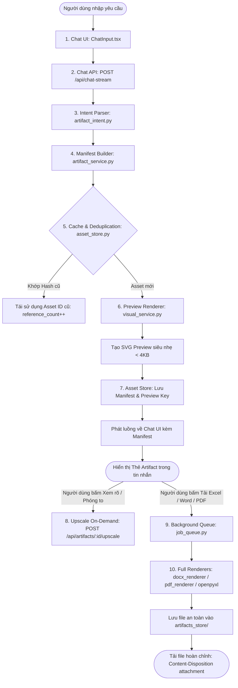

# QUY TRÌNH DỰNG NỘI DUNG ARTIFACTS (ARTIFACT PIPELINE)

Tài liệu này mô tả chi tiết quy trình xử lý theo mô hình **"mô tả nhẹ – dựng nội dung khi cần"** (Lightweight Manifest – Render On-Demand) từ lúc người dùng đặt câu hỏi bằng ngôn ngữ tự nhiên đến khi tải về tài liệu hoàn chỉnh.

---

## 1. Sơ Đồ Luồng Tổng Thể (End-to-End Flowchart)

---

## 2. Chi Tiết Từng Bước Kèm Đường Dẫn Code Thực Tế

### Bước 1: Người dùng nhập yêu cầu (Chat UI)
- **Đường dẫn code**: [frontend/src/features/chat/components/ChatInput.tsx](../frontend/src/features/chat/components/ChatInput.tsx)
- **Hoạt động**: Người dùng nhập câu hỏi tra cứu (ví dụ: *"Học phí của trường là bao nhiêu?"*) hoặc yêu cầu sinh tài liệu cụ thể (ví dụ: *"Tạo file excel học phí các ngành HUIT 2026"*).
- **Tối ưu Token**: Giao diện chỉ gửi lịch sử tin nhắn dạng text tóm tắt, tuyệt đối không gửi Base64 hay binary vào hội thoại.

### Bước 2: Tiếp nhận qua Chat API
- **Đường dẫn code**: [backend/app/api/routes/chat.py](../backend/app/api/routes/chat.py) $\rightarrow$ [backend/app/rag/pipeline.py](../backend/app/rag/pipeline.py)
- **Hoạt động**: FastAPI middleware tự động cấp phát `X-Request-ID`. Hàm `stream_answer()` tiếp nhận câu hỏi, lịch sử và chuẩn bị luồng NDJSON streaming.

### Bước 3: Phân tích ý định (Intent Parser)
- **Đường dẫn code**: [backend/app/rag/artifact_intent.py](../backend/app/rag/artifact_intent.py) (hàm `detect_file_generation_intent()` và `should_attach_illustrative_infographic()`).
- **Hoạt động**:
  - Nhận diện yêu cầu sinh file cụ thể: `.xlsx`, `.docx`, `.pdf`, `.svg`.
  - Nhận diện câu hỏi thông tin (học phí, điểm chuẩn) cần kèm infographic minh họa.
  - Trích xuất dữ liệu gốc chuẩn xác từ `TUITION_DATA_2026` hoặc `CUTOFF_DATA_2026` để đảm bảo số liệu trên infographic khớp 100% với câu trả lời bằng chữ.

### Bước 4: Xây dựng Kế hoạch Siêu Nhẹ (Manifest Builder)
- **Đường dẫn code**: [backend/app/services/artifact_service.py](../backend/app/services/artifact_service.py) (hàm `_resolve_template_and_content_for_prompt()` & `create_artifact_plan()`).
- **Schema Pydantic**: [backend/app/api/schemas/artifact.py](../backend/app/api/schemas/artifact.py) (lớp `ArtifactManifest`).
- **Quy tắc an toàn**: Manifest chỉ chứa dữ liệu cấu trúc sạch, style và template_id. Cấm Base64 lớn, dung lượng tối đa giới hạn $\le 32$KB.

### Bước 5: Chống Sinh Trùng Lặp & Khóa Tương Tranh (Cache & Deduplication)
- **Đường dẫn code**: [backend/app/services/asset_store.py](../backend/app/services/asset_store.py) (hàm `compute_canonical_hash()` & `get_hash_lock()`).
- **Hoạt động**:
  - Tính SHA-256 canonical hash từ `(prompt_chuẩn_hóa, template_id, content, style, renderer_version)`.
  - Tra cứu trong RAM Cache (0ms) $\rightarrow$ MongoDB Atlas collection `assets`.
  - Nếu đã có: Tái sử dụng `asset_id` cũ, tăng `reference_count` thêm 1.
  - Sử dụng `asyncio.Lock` theo từng hash để ngăn chặn trường hợp 5 requests giống nhau cùng kích hoạt render đồng thời.

### Bước 6: Dựng Bản Xem Trước Tức Thì (Preview Renderer)
- **Đường dẫn code**: [backend/app/services/visual_service.py](../backend/app/services/visual_service.py) (hàm `render_svg_visual()`).
- **Hoạt động**: Dựng ảnh vector SVG nhận diện thương hiệu HUIT (màu xanh #0066C4) trong thời gian cực ngắn (< 15ms, dung lượng < 4KB). Không sinh file nặng ở bước này!

### Bước 7: Lưu Trữ Tài Nguyên (Asset Store)
- **Đường dẫn code**: [backend/app/services/asset_store.py](../backend/app/services/asset_store.py) (hàm `AssetStore.save_asset()`).
- **Hoạt động**: Lưu trữ manifest và metadata vào MongoDB Atlas collection `assets`. Trả về đường dẫn preview `/api/artifacts/{id}/preview`.

### Bước 8: Hiển Thị Thẻ Trên Giao Diện (Chat UI Artifact Card)
- **Đường dẫn code**: [frontend/src/features/admission-visuals/components/VisualCard.tsx](../frontend/src/features/admission-visuals/components/VisualCard.tsx)
- **Hoạt động**: Hiển thị thẻ Artifact với SVG preview sắc nét, badge định dạng, tiêu đề và các nút: "Xem rõ", "SVG", "Excel", "Word", "PDF".

### Bước 9: Dựng Nặng Theo Yêu Cầu (Background Queue & Full Renderers)
- **Đường dẫn code**:
  - Hàng đợi nền: [backend/app/services/job_queue.py](../backend/app/services/job_queue.py) (`JobQueueManager`)
  - Trình dựng Word: [backend/app/services/docx_renderer.py](../backend/app/services/docx_renderer.py) (`python-docx`)
  - Trình dựng PDF: [backend/app/services/pdf_renderer.py](../backend/app/services/pdf_renderer.py) (`reportlab`)
  - Trình dựng Excel: [backend/app/services/visual_service.py](../backend/app/services/visual_service.py) (`openpyxl`)
  - Trình dựng Upscale: [backend/app/services/artifact_service.py](../backend/app/services/artifact_service.py) (`upscale_artifact()`)
- **Hoạt động**: Khi người dùng nhấn tải hoặc yêu cầu render, hệ thống mới tiến hành tạo file nhị phân, kiểm tra MIME và lưu vào thư mục an toàn `data/artifacts_store/asset_{id}.{ext}`.

### Bước 10: Tải File Xuất Hoàn Chỉnh (Download / Export API)
- **Đường dẫn code**: [backend/app/api/routes/artifacts.py](../backend/app/api/routes/artifacts.py) (endpoint `/api/artifacts/{id}/export`).
- **Hoạt động**: Trả về file tải xuống với header `Content-Disposition: attachment; filename="..."` và `Cache-Control: private, no-store` cho tài nguyên riêng tư.
