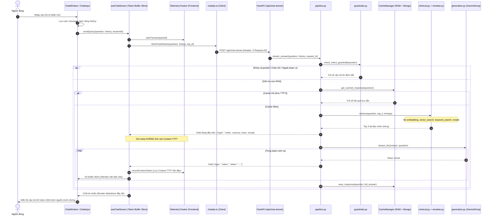

# HUIT CHATBOT - BẢN ĐỒ ĐIỀU HƯỚNG MÃ NGUỒN (CODE MAP)

Tài liệu này cung cấp bản đồ chi tiết toàn bộ kiến trúc mã nguồn sau tái cấu trúc của dự án Chatbot HUIT. Tất cả liên kết sử dụng đường dẫn tương đối để tương thích đa nền tảng.

---

## 1. Bảng Tra Cứu Chức Năng $\rightarrow$ Mã Nguồn

| Chức Năng Nghiệp Vụ | File Frontend | Hook / Symbol Frontend | File Backend | Route / Handler Backend | Test Tương Ứng |
| :--- | :--- | :--- | :--- | :--- | :--- |
| **Gửi câu hỏi & Tách History** | [ChatWindow.tsx](../frontend/src/features/chat/components/ChatWindow.tsx) | `handleSendMessage()`, [useConversation.ts](../frontend/src/features/chat/hooks/useConversation.ts) (`loadSession`) | [chat.py](../backend/app/api/routes/chat.py) | `handle_chat_stream()`, [pipeline.py](../backend/app/rag/pipeline.py) | [chat_flow.test.ts](../frontend/tests/chat_flow.test.ts), [ChatWindow.test.tsx](../frontend/tests/ChatWindow.test.tsx) |
| **Phát luồng NDJSON & Request Isolation** | [useChatStream.ts](../frontend/src/features/chat/hooks/useChatStream.ts) | `sendQuery()`, `StreamRequestContext`, `flushTokenBuffer()` | [chat.py](../backend/app/api/routes/chat.py) | `handle_chat_stream()` $\rightarrow$ `stream_answer()` | [useChatStream.test.ts](../frontend/tests/useChatStream.test.ts), [test_api.py](../backend/tests/test_api.py) |
| **Dừng sinh (Abort) & Chống Stale Request** | [ChatInput.tsx](../frontend/src/features/chat/components/ChatInput.tsx) | `stopStreaming()` (idempotent), `activeRequestRef` | [chat.py](../backend/app/api/routes/chat.py) | Ngắt kết nối `StreamingResponse` | [useChatStream.test.ts](../frontend/tests/useChatStream.test.ts), [App.test.tsx](../frontend/tests/App.test.tsx) |
| **Vòng đời Session & Không Unmount** | [App.tsx](../frontend/src/app/App.tsx) | Không dùng `key={currentSessionId}`, đồng bộ session an toàn | N/A | N/A | [App.test.tsx](../frontend/tests/App.test.tsx), [ChatWindow.test.tsx](../frontend/tests/ChatWindow.test.tsx) |
| **Sinh ID Duy Nhất An Toàn** | [idGenerator.ts](../frontend/src/shared/utils/idGenerator.ts) | `generateUniqueId()` (`crypto.randomUUID` + fallback) | N/A | N/A | [useChatStream.test.ts](../frontend/tests/useChatStream.test.ts) |
| **Render Stream Nhẹ & Markdown Cuối** | [ChatMessageItem.tsx](../frontend/src/features/chat/components/ChatMessageItem.tsx) | `streaming-text-block` / [markdown.ts](../frontend/src/shared/lib/markdown.ts) | [generation.py](../backend/app/rag/generation.py) | `clean_llm_text()` | [test_rag_pipeline.py](../backend/tests/test_rag_pipeline.py) |
| **Parser NDJSON Stream Client** | [ndjsonParser.ts](../frontend/src/features/chat/utils/ndjsonParser.ts) | `parseNDJSONStream()` | [pipeline.py](../backend/app/rag/pipeline.py) | `yield json.dumps(...)` | [ndjsonParser.test.ts](../frontend/tests/ndjsonParser.test.ts) |
| **Trích dẫn nguồn minh chứng** | [SourceCitations.tsx](../frontend/src/features/chat/components/SourceCitations.tsx) | Render Source badge `[n]` | [reranker.py](../backend/app/rag/reranker.py) | `retrieve()` $\rightarrow$ `sources` | [test_rag_pipeline.py](../backend/tests/test_rag_pipeline.py) |
| **Hiển thị 4 bước RAG Trace** | [TraceTimeline.tsx](../frontend/src/features/chat/components/TraceTimeline.tsx) | Accordion Timeline | [pipeline.py](../backend/app/rag/pipeline.py) | `trace` metadata | [test_api.py](../backend/tests/test_api.py) |
| **Sơ đồ SVG & Thẻ ngành Tuyển sinh** | [VisualCard.tsx](../frontend/src/features/admission-visuals/components/VisualCard.tsx) | [useVisualLightbox.ts](../frontend/src/features/admission-visuals/hooks/useVisualLightbox.ts) | [visuals.py](../backend/app/api/routes/visuals.py) | `render_visual()` $\rightarrow$ [visual_service.py](../backend/app/services/visual_service.py) | [test_api.py](../backend/tests/test_api.py) |
| **Sinh ảnh AI FLUX.1 & SVG** | [ImageGenerationModal.tsx](../frontend/src/features/image-generation/components/ImageGenerationModal.tsx) | [useImageGeneration.ts](../frontend/src/features/image-generation/hooks/useImageGeneration.ts) | [images.py](../backend/app/api/routes/images.py) | `generate_image_endpoint()` $\rightarrow$ [image_service.py](../backend/app/services/image_service.py) | [test_api.py](../backend/tests/test_api.py) |
| **Lịch sử trò chuyện cục bộ** | [HistoryDrawer.tsx](../frontend/src/features/history/components/HistoryDrawer.tsx) | [useChatHistory.ts](../frontend/src/features/history/hooks/useChatHistory.ts) | Không lưu PII lên server | Lưu trữ `localStorage` an toàn | [chat_flow.test.ts](../frontend/tests/chat_flow.test.ts) |
| **Nhận diện giọng nói (STT)** | [ChatInput.tsx](../frontend/src/features/chat/components/ChatInput.tsx) | [useSpeechRecognition.ts](../frontend/src/features/voice/hooks/useSpeechRecognition.ts) | Web Speech API | Client-side Native | N/A |
| **Đọc to câu trả lời (TTS)** | [ChatMessageItem.tsx](../frontend/src/features/chat/components/ChatMessageItem.tsx) | [useSpeechSynthesis.ts](../frontend/src/features/voice/hooks/useSpeechSynthesis.ts) | Web Speech API | Client-side Native | N/A |
| **Theme Dark / Light mode** | [Header.tsx](../frontend/src/shared/components/Header.tsx) | [useTheme.ts](../frontend/src/features/theme/hooks/useTheme.ts) | [index.css](../frontend/src/styles/index.css) | Tokens `:root` & `[data-theme='dark']` | N/A |
| **RAM Cache & MongoDB Cache** | Nhận cờ `cached: true` | [useChatStream.ts](../frontend/src/features/chat/hooks/useChatStream.ts) | [mongo_cache.py](../backend/app/cache/mongo_cache.py) | `CacheManager.get_cached_response()` | [test_rag_pipeline.py](../backend/tests/test_rag_pipeline.py) (`test_memory_cache`) |
| **Observability & Telemetry** | [telemetryTracker.ts](../frontend/src/observability/telemetryTracker.ts) | `startTrace()`, `recordContentToken()` | [metrics.py](../backend/app/telemetry/metrics.py) | `LatencyBreakdown` (10 số đo), `log_event()` | [test_rag_pipeline.py](../backend/tests/test_rag_pipeline.py) (`test_latency_breakdown_metrics`) |
| **Bảo mật Quản trị & Startup Validation** | Client gửi Header `Authorization` | Bearer token | [config.py](../backend/app/config.py), [admin.py](../backend/app/api/routes/admin.py) | `validate_security_config()`, `admin_login()` | [test_api.py](../backend/tests/test_api.py) (4 tests kiểm tra cấu hình) |
| **Kiểm tra Health (Có/Không DB)** | N/A | Status ping | [health.py](../backend/app/api/routes/health.py) | `health()` endpoint | [test_api.py](../backend/tests/test_api.py) (`test_health_with_database_connected`) |

---

## 2. Luồng Dữ Liệu Toàn Diện (End-to-End Flow)

---

## 3. "Muốn sửa gì thì vào đâu?" (Quick Troubleshooting Guide)

### 🔹 Vòng đời phiên trò chuyện (Session Lifecycle):
- **Bỏ key unmount**: [App.tsx](../frontend/src/app/App.tsx) hiển thị `<ChatWindow>` liên tục, không dùng `key={currentSessionId}` để tránh unmount mất dữ liệu.
- **Cách ly tin nhắn giữa các session**: [ChatWindow.tsx](../frontend/src/features/chat/components/ChatWindow.tsx) sử dụng `sessionMessagesMapRef` và `prevSessionIdRef`, tự động chốt câu hỏi + phần trả lời đã nhận vào session cũ trước khi nạp session mới.
- **Hook đồng bộ state**: [useConversation.ts](../frontend/src/features/chat/hooks/useConversation.ts) cung cấp hàm `loadSession(sessionId, messages)` an toàn, không gọi `setState` trực tiếp trong quá trình render.

### 🔹 Gửi chat & Luồng streaming (Request Replacement):
- **Client Hook**: [useChatStream.ts](../frontend/src/features/chat/hooks/useChatStream.ts):
  - Khởi tạo `StreamRequestContext` độc lập cho từng request (gồm `requestId`, `sessionId`, `aiMessageId`, `AbortController`, `tokenBuffer`, `timer`, `draft`, `callbackDispatched`).
  - Khi có request mới thay thế hoặc người dùng dừng (`stopStreaming`), request cũ được abort và chốt đúng 1 lần (idempotent), không đè timer hay biến trạng thái của request mới.
  - Xử lý cleanup an toàn khi unmount, xả hết token còn lại và báo `onMessageComplete`.
- **Server Pipeline**: [pipeline.py](../backend/app/rag/pipeline.py) (hàm `stream_answer`).

### 🔹 Sinh ID duy nhất:
- Sửa tại [idGenerator.ts](../frontend/src/shared/utils/idGenerator.ts) (sử dụng `crypto.randomUUID()` với fallback tương thích).

### 🔹 Dừng sinh (Abort) & Chống Stale response:
- **Client**: Sửa tại [useChatStream.ts](../frontend/src/features/chat/hooks/useChatStream.ts) (kiểm tra `requestId` trùng khớp trước mọi thao tác cập nhật).
- **Input button**: Sửa tại [ChatInput.tsx](../frontend/src/features/chat/components/ChatInput.tsx).

### 🔹 Hiển thị Markdown & Định dạng an toàn:
- Sửa chiến lược render tại [ChatMessageItem.tsx](../frontend/src/features/chat/components/ChatMessageItem.tsx).
- Sửa hàm làm sạch và render HTML tại [markdown.ts](../frontend/src/shared/lib/markdown.ts).
- Sửa CSS typography tại [chat.css](../frontend/src/styles/chat.css) (`.message-bubble`).

### 🔹 Lịch sử trò chuyện (Chat Sessions):
- Sửa quản lý hội thoại tại [useConversation.ts](../frontend/src/features/chat/hooks/useConversation.ts).
- Sửa lưu/đọc LocalStorage tại [useChatHistory.ts](../frontend/src/features/history/hooks/useChatHistory.ts).
- Sửa thanh bên tại [HistoryDrawer.tsx](../frontend/src/features/history/components/HistoryDrawer.tsx).

### 🔹 Bảo mật cấu hình khởi động (Production Security Startup):
- Sửa tại [config.py](../backend/app/config.py) (`validate_security_config()`) và [main.py](../backend/app/main.py).
- Bắt buộc khai báo `ADMIN_USERNAME`, `ADMIN_PASSWORD`, `ADMIN_TOKEN`, `CORS_ALLOWED_ORIGINS` khi môi trường khác `development`.

### 🔹 Observability & Đo lường hiệu năng:
- **Frontend Tracker**: Sửa tại [telemetryTracker.ts](../frontend/src/observability/telemetryTracker.ts) (phân biệt `completed` và `aborted`, giới hạn `recordCommitDuration` theo `currentActiveRequestId`).
- **Backend Latency Breakdown**: Sửa tại [metrics.py](../backend/app/telemetry/metrics.py) (class `LatencyBreakdown`).
- **Báo cáo hiệu năng**: Đọc và cập nhật tại [PERFORMANCE.md](PERFORMANCE.md).

### 🔹 Thuật toán tìm kiếm & Xếp hạng (RAG Retrieval & Rerank):
- **Dense Vector Search**: Sửa tại [retrieval.py](../backend/app/rag/retrieval.py) (hàm `search_vector`).
- **Sparse Keyword Search**: Sửa tại [retrieval.py](../backend/app/rag/retrieval.py) (hàm `search_keyword`).
- **Trọng số RRF & Heuristics**: Sửa tại [reranker.py](../backend/app/rag/reranker.py) (hàm `rerank_and_filter` và `apply_heuristic_overrides`).

### 🔹 Bộ nhớ đệm (Cache):
- **RAM Cache**: Sửa tại [memory_cache.py](../backend/app/cache/memory_cache.py).
- **MongoDB Persistent Cache**: Sửa tại [mongo_cache.py](../backend/app/cache/mongo_cache.py).
