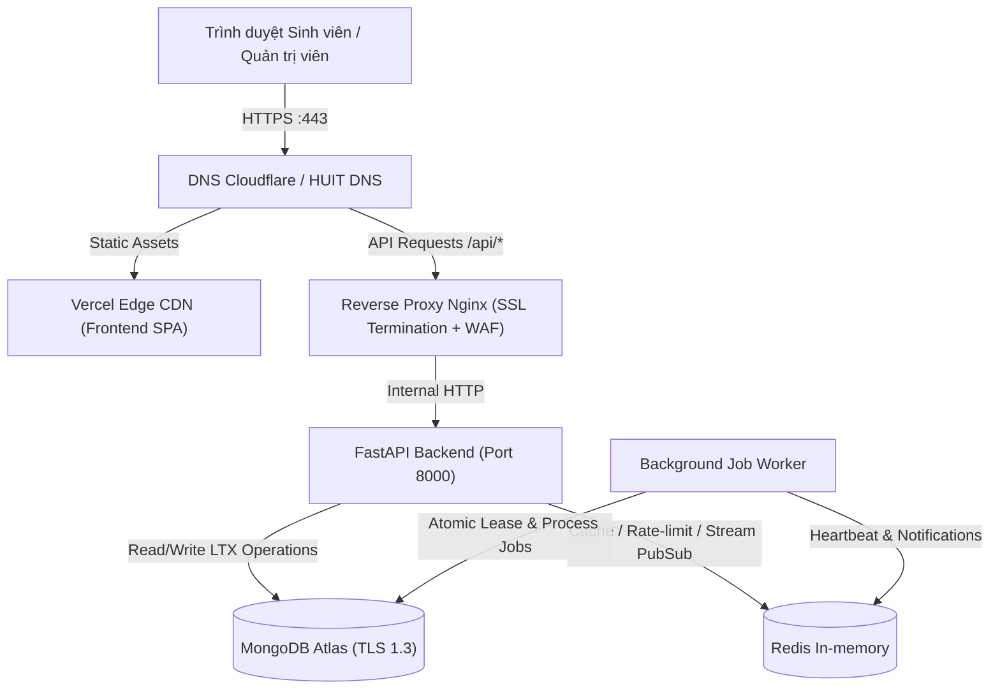

# HƯỚNG DẪN CHIẾN LƯỢC TRIỂN KHAI VERCEL, DOCKER & TÊN MIỀN HUIT CHATBOT

> **Tài liệu Kỹ thuật**: Release Engineering & Full-stack Architecture  
> **Phiên bản**: 2.0.0-PROD  
> **Ngày lập**: 16/09/2026  
> **Hệ thống**: HUIT Admissions RAG Chatbot System

---

## 1. Kiến Trúc Triển Khai Tổng Thể (Production Topology)

Để đảm bảo hiệu năng cao nhất, tính sẵn sàng cao và khả năng mở rộng không giới hạn:
- **Frontend (Giao diện người dùng & Admin Portal)**: Triển khai trên **Vercel Global Edge CDN** (Frontend-only Static Build). Tốc độ tải trang < 0.5s trên toàn quốc, tự động nén Brotli/Gzip, hỗ trợ cache Edge tức thì.
- **Backend & Background Worker**: Triển khai trên **VPS / Bare-metal Server / Cloud Container VM** bằng `docker-compose.prod.yml`. Đảm bảo tiến trình uvicorn bất đồng bộ, stream NDJSON không bị ngắt quãng, worker xử lý tác vụ nặng (Docx, Xlsx, PDF, Upscale) và MongoDB/Redis nằm hoàn toàn trong mạng nội bộ (`backend_net` internal).
- **Cơ sở dữ liệu**: MongoDB Atlas Replica Set (Primary/Secondary) + Redis Cluster/In-memory.



---

## 2. Hướng Dẫn Cấu Hình Vercel (Frontend-only)

### 2.1 Cài đặt Project trên Vercel Dashboard
1. Truy cập [Vercel Dashboard](https://vercel.com).
2. Nhấn **Add New...** $\rightarrow$ **Project** $\rightarrow$ Chọn repository `huit-chatbot`.
3. Cấu hình các thiết lập cơ bản:
   - **Framework Preset**: `Vite`
   - **Root Directory**: `frontend`
   - **Build Command**: `npm run build`
   - **Output Directory**: `dist`
   - **Install Command**: `npm ci`
4. **Environment Variables** (Thiết lập trên Vercel):
   - `VITE_API_BASE_URL`: `https://api-chatbot.huit.edu.vn` (hoặc để trống nếu dùng reverse proxy rewrite).

### 2.2 Tệp `frontend/vercel.json` Chuẩn Cho Frontend
```json
{
  "version": 2,
  "cleanUrls": true,
  "headers": [
    {
      "source": "/(.*)",
      "headers": [
        { "key": "X-Content-Type-Options", "value": "nosniff" },
        { "key": "X-Frame-Options", "value": "DENY" },
        { "key": "Referrer-Policy", "value": "strict-origin-when-cross-origin" },
        { "key": "Permissions-Policy", "value": "camera=(), microphone=(), geolocation=(), payment=()" }
      ]
    },
    {
      "source": "/assets/(.*)",
      "headers": [
        { "key": "Cache-Control", "value": "public, max-age=31536000, immutable" }
      ]
    }
  ],
  "rewrites": [
    {
      "source": "/api/(.*)",
      "destination": "https://api-chatbot.huit.edu.vn/api/$1"
    },
    {
      "source": "/healthz",
      "destination": "https://api-chatbot.huit.edu.vn/health"
    },
    {
      "source": "/(.*)",
      "destination": "/index.html"
    }
  ]
}
```

---

## 3. Triển Khai Backend & Worker Bằng Docker Compose Trên VPS

### 3.1 Cấu hình Biến môi trường (`/opt/huit-chatbot/.env`)
```bash
# Production Environment
APP_ENV=production

# Security & Secrets (ĐÃ ĐƯỢC XOAY VÒNG BẢO MẬT)
ADMIN_USERNAME=huit_admin_sec
ADMIN_PASSWORD=<MatKhauSieuManhRandom32KyTu>
ADMIN_TOKEN=<HMACSecretHex64KyTu>

# CORS & Domain
CORS_ALLOWED_ORIGINS=https://chatbot.huit.edu.vn,https://huit-chatbot.vercel.app
TRUSTED_PROXIES=127.0.0.1/32,::1/128,10.0.0.0/8,172.16.0.0/12

# Database & Cache
MONGODB_URI=mongodb+srv://huit_prod_user:<AtlasPassword>@cluster0.huit.mongodb.net/huit_chatbot?retryWrites=true&w=majority
MONGODB_DB=huit_chatbot
REDIS_URL=redis://redis:6379/0
RATE_LIMIT_REDIS_URL=redis://redis:6379/0
STREAM_RESUME_REDIS_URL=redis://redis:6379/1

# Storage
STORAGE_BACKEND=local
STORAGE_ROOT=/app/data/artifacts_store
```

### 3.2 Khởi chạy với `docker-compose.prod.yml`
```bash
# 1. Kiểm tra cú pháp compose
docker compose -f docker-compose.prod.yml config

# 2. Build image
docker compose -f docker-compose.prod.yml build

# 3. Khởi động background daemon
docker compose -f docker-compose.prod.yml up -d

# 4. Kiểm tra logs
docker compose -f docker-compose.prod.yml logs -f --tail=100 backend
```

---

## 4. Chiến Lược Tên Miền & Chứng Chỉ SSL (Domain & DNS Strategy)

### 4.1 Mô hình Phân Vùng Tên Miền (Domain Mapping)
| Phân vùng | Tên miền khuyến nghị | Đích đến (Target) | Ghi chú |
| :--- | :--- | :--- | :--- |
| **Giao diện Sinh viên** | `chatbot.huit.edu.vn` | `cname.vercel-dns.com` | CDN Vercel, SSL tự động |
| **API Backend Gateway** | `api-chatbot.huit.edu.vn` | IP Máy chủ VPS (`A record`) | Nginx Reverse Proxy |
| **Quản trị viên** | `chatbot.huit.edu.vn/admin` | Nằm chung giao diện Vercel | Bảo vệ HttpOnly Cookie & CSRF |

### 4.2 Cấu hình Cloudflare WAF / Reverse Proxy
- Bật **Full (Strict) SSL/TLS Encryption** giữa Cloudflare và VPS Nginx.
- Bật **HTTP/2** hoặc **HTTP/3 (QUIC)**.
- Rate Limit Rules trên Cloudflare:
  - Giới hạn tối đa 60 requests/phút trên route `/api/admin/login` nhằm chống brute-force tầng mạng trước khi request chạm vào uvicorn.
  - Chặn hoàn toàn bot scraper thô (AI Scraper, Bad User-Agents).

---

## 5. Quy Chuẩn Branch Protection Trên GitHub

Để duy trì mã nguồn sạch và bảo mật tuyệt đối:
1. **Chi nhánh `main`**:
   - Bắt buộc tạo Pull Request (PR) trước khi hợp nhất.
   - Bắt buộc kiểm tra ít nhất 1 phê duyệt (Code Review Approval).
   - Bắt buộc toàn bộ Status Checks (GitHub Actions CI) phải PASS:
     - `compileall` (Python syntax check).
     - `pytest` (Toàn bộ test suite backend).
     - `npm test` (Vitest frontend).
     - `npm run lint` (Oxlint).
     - `npm run build` (TypeScript check & Vite bundling).
     - `docker compose config` (Cấu hình container hợp lệ).
   - Chặn force push (`git push --force`) và chặn xóa nhánh `main`.
