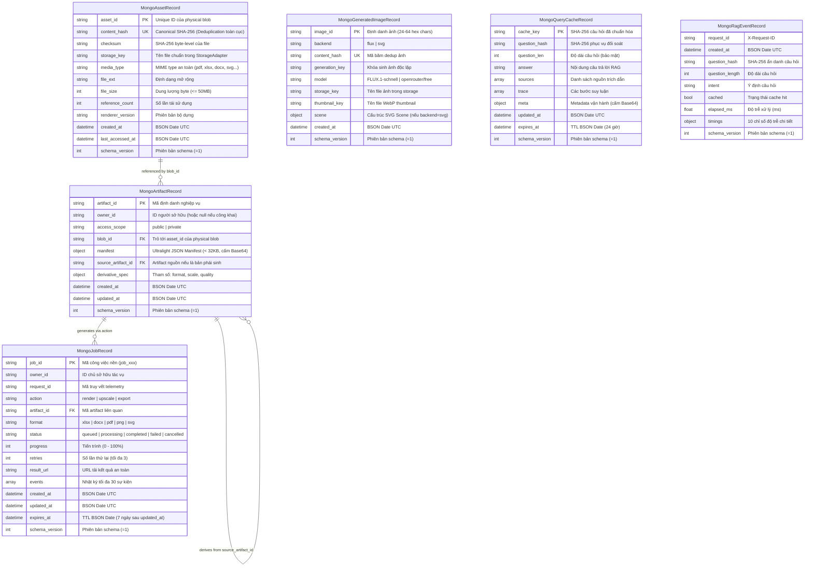

# THIẾT KẾ SCHEMA MONGODB PRODUCTION-READY (MONGODB SCHEMA SPECIFICATION)

Tài liệu này định nghĩa toàn diện kiến trúc cơ sở dữ liệu MongoDB Atlas cho hệ thống HUIT Chatbot (`huit_chatbot`), bao gồm mô hình phân tách dữ liệu vật lý (Physical Asset/Blob) và quyền sở hữu (Logical Artifact Ownership), danh mục `$jsonSchema` validators, hệ thống indexes, TTL, chính sách bảo vệ quyền riêng tư và quy trình vận hành an toàn.

---

## 1. Sơ Đồ Thực Thể & Quan Hệ (Entity Relationship Diagram)

---

## 2. Kiến Trúc Phân Tách Blob & Quyền Sở Hữu (Ownership Separation)

### 2.1. Nguyên Tắc Cốt Lõi
- **Physical Asset / Blob (`assets`)**: Chỉ lưu trữ các thuộc tính vật lý của file tĩnh (`content_hash`, `checksum`, `storage_key`, `file_size`, `media_type`). Không lưu thông tin người dùng hay dữ liệu cá nhân. `content_hash` unique toàn cục giúp tái sử dụng tối đa file vật lý trên đĩa lưu trữ.
- **Logical Artifact (`artifacts` hoặc bản ghi ownership)**: Quản lý quyền truy cập của từng người dùng (`owner_id`, `access_scope: public | private`).
- **Loại trừ rủi ro rò rỉ**: Khi hai người dùng A và B vô tình tạo tài nguyên riêng tư có nội dung giống hệt nhau, hệ thống sinh ra 2 bản ghi `artifact` riêng biệt với `owner_id` khác nhau. Dữ liệu vật lý dùng chung 1 `blob_id`, nhưng Người dùng B **hoàn toàn không thể** truy cập hoặc đọc được manifest của Người dùng A.

### 2.2. Bản Phái Sinh (Derivatives & Upscaling)
Mỗi bản phái sinh được định danh xác định bởi bộ 5 tham số:
$$\text{derivative\_hash} = \text{SHA256}(\text{source\_asset\_id} + \text{format} + \text{scale} + \text{quality} + \text{renderer\_version})$$
Mọi yêu cầu upscale hoặc chuyển đổi định dạng có cùng bộ tham số sẽ tái sử dụng cùng một physical blob.

---

## 3. Danh Mục Collections & Validators (`$jsonSchema`)

Tất cả các collection chính đều được áp dụng `$jsonSchema` validator với cấu hình:
- `validationLevel`: `"moderate"`
- `validationAction`: `"error"`

### 3.1. Collection `assets`
- **Bắt buộc**: `asset_id`, `content_hash`, `media_type`, `file_ext`, `storage_key`, `file_size`, `renderer_version`, `created_at`.
- **Cấm**: Base64, raw binary `image_data`, đường dẫn tuyệt đối, ký tự path traversal `..` trong `storage_key`.
- **Giới hạn kích thước file**: Tối đa 52,428,800 bytes (50 MB).

### 3.2. Collection `jobs`
- **Bắt buộc**: `job_id`, `action`, `status`, `progress`, `attempt`, `max_attempts`, `idempotency_key`, `lease_owner`, `lease_expires_at`, `heartbeat_at`, `available_at`, `created_at`, `updated_at`.
- **Enum Status**: `["queued", "processing", "completed", "failed", "cancelled"]`.
- **Progress**: Số nguyên từ 0 đến 100.
- **Độ bền worker**: `attempt`/`max_attempts` giới hạn retry; lease và heartbeat cho phép worker khác thu hồi job bị treo; `idempotency_key` chống tạo job trùng.
- **Events**: Mảng chứa tối đa 50 phần tử.

### 3.3. Collection `generated_images`
- **Bắt buộc**: `image_id`, `content_hash`, `request_fingerprint`, `blob_id`, `access_scope`, `model`, `created_at`.
- Hỗ trợ 2 định dạng tài liệu:
  - **Raster (FLUX)**: `backend="flux"`, `image_id`, `content_hash`, `model`, `storage_key`, `thumbnail_key`, `byte_size`, `created_at`.
  - **Vector (SVG)**: `backend="svg"`, `image_id`, `content_hash`, `model`, `scene`, `scene_bytes`, `created_at`.
- **Cấm**: Lưu binary ảnh trực tiếp (`image_data`) trong MongoDB mới. Mọi binary phải chuyển qua `StorageAdapter`.
- **Phân quyền**: `access_scope` chỉ nhận `public`, `private` hoặc `legacy_public`; dedup request được cô lập theo `owner_id`.

### 3.4. Collection `admission_visuals`
- **Bắt buộc sau migration 016**: `visual_id`, `type`, `category`, `title`, `created_at`.
- **Cấm sau migration 016**: `image_base64`, `image_data`, `binary`, `blob`.
- MongoDB chỉ giữ scene/bảng JSON nhỏ và khóa tham chiếu; SVG/PNG/Excel được render hoặc export theo yêu cầu.
- Từ migration 016 ngày 2026-09-15, validator này đã được áp dụng production và 46/46 tài liệu cũ đã được thu gọn.

### 3.5. Collection `query_cache`
- **Bắt buộc**: `schema_version`, `cache_key`, `question_hash`, `question_len`, `answer`, `updated_at`, `expires_at`.
- **Cấm**: Tuyệt đối không lưu trường `original_question` hoặc chat history thô dạng plain text. Cấm nhúng Base64 lớn trong `meta`.

### 3.6. Collection `rag_events`
- **Bắt buộc**: `schema_version`, `request_id`, `created_at`, `question_hash`, `question_length`, `intent`, `elapsed_ms`.
- **Cấm**: Tuyệt đối không lưu trường `question` dạng plain text. Chỉ lưu `question_hash` (SHA-256) và `question_length`.

---

## 4. Ma Trận Index & TTL (Index Specification)

| Collection | Tên Index / Khóa | Thuộc tính | Mục đích |
| :--- | :--- | :--- | :--- |
| **`assets`** | `asset_id_1` | `unique: true` | Khóa định danh truy xuất trực tiếp |
| | `content_hash_1` | `unique: true, sparse: true` | Deduplication file vật lý toàn cục |
| | `checksum_1` | `sparse: true` | Tra cứu theo mã băm nhị phân |
| | `created_at_-1` | Standard | Sắp xếp và truy vấn lịch sử |
| | `last_accessed_at_-1` | Standard | Dọn dẹp cache LRU |
| **`jobs`** | `job_id_1` | `unique: true` | Khóa định danh công việc nền |
| | `idempotency_key_unique_v1` | `unique: true, partial string` | Chống tạo trùng một logical job |
| | `owner_id_1_updated_at_-1` | `sparse: true` | Lấy danh sách job của user |
| | `status_1_updated_at_-1` | Standard | Worker quét job `queued` / `processing` |
| | `request_id_1` | `sparse: true` | Truy vết telemetry theo request |
| | `expires_at_1` | `expireAfterSeconds: 0, sparse: true` | TTL xóa job cũ sau 7 ngày |
| **`generated_images`** | `image_id_1` | `unique: true` | Khóa định danh ảnh AI |
| | `owner_request_fingerprint_unique_v1` | `unique: true, partial` | Chống request trùng trong cùng owner; không rò dedup chéo người dùng |
| | `content_hash_lookup_v1` | Standard | Tra cứu nội dung giống nhau, không ép uniqueness toàn cục |
| | `created_at_-1` | Standard | Sắp xếp lịch sử sinh ảnh |
| **`query_cache`** | `cache_key_1` | `unique: true` | Tra cứu cache tức thì & chống duplicate |
| | `expires_at_1` | `expireAfterSeconds: 0` | TTL xóa cache hết hạn tự động (24h) |
| | `updated_at_-1` | Standard | Thống kê cache |
| **`rag_events`** | `request_id_1` | `sparse: true` | Truy vết request ID |
| | `created_at_-1` | Standard | Phân tích telemetry theo chuỗi thời gian |
| | `intent_1_created_at_-1` | Standard | Báo cáo phân bổ ý định người dùng |
| **`admission_visuals`** | `visual_id_1` | `unique: true` | Định danh đồ họa tuyển sinh |
| | `major_code_1` | Standard | Lọc theo mã ngành đào tạo |
| | `category_1` | Standard | Lọc theo danh mục tuyển sinh |
| **`huit_kb`** | `huit_vector_index` | **Atlas Vector Search Index (1024D)** | Tìm kiếm ngữ nghĩa bằng `multilingual-e5-large` (Không can thiệp bằng lệnh Mongo thường) |

---

## 5. Chính Sách Lưu Trữ Tệp (Storage Strategy)

- **Nguyên tắc**: MongoDB **chỉ** lưu trữ siêu dữ liệu và khóa tham chiếu (`storage_key`). File vật lý được lưu trữ thông qua `StorageAdapter`.
- **Tính lũy đẳng**: Export Excel chuẩn hóa metadata và ZIP timestamp để cùng một manifest tạo cùng bytes/checksum; các derivative/upscale có cùng tham số tái sử dụng cùng physical blob.
- **Môi trường Development**: Dùng `LocalStorageAdapter`, lưu file an toàn tại `data/artifacts_store/` với cơ chế chặn tấn công Path Traversal nghiêm ngặt.
- **Môi trường Production**: Dùng `ObjectStorageAdapter` kết nối với Cloud Object Storage (S3/Cloudflare R2/Supabase) để tránh mất mát dữ liệu do filesystem tạm thời của Vercel/serverless.
- **Chính sách dọn dẹp (Reference Counting)**: File vật lý chỉ được phép xóa khi `reference_count == 0` và không còn bất kỳ `artifact` hay `job` nào tham chiếu tới.
- **Trạng thái đối soát 2026-09-15**: 46 assets còn hiệu lực đều có `storage_key` và physical object; 7 file đã được phục hồi từ scene/manifest; 12 placeholder chưa render đã được gỡ tham chiếu rồi xóa record vật lý rỗng. Sau khi tính đủ `preview_key`, `thumbnail_key` và `admission_visuals.storage_key`, 4 orphan thật đã được xác minh checksum và chuyển sang quarantine có thể phục hồi; không có file nào bị xóa vĩnh viễn.
