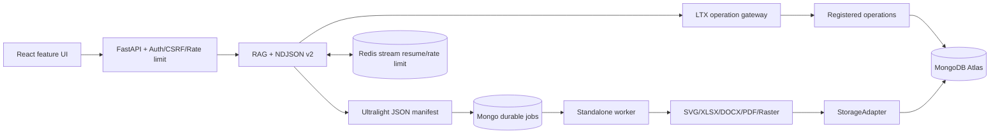

# Báo cáo nghiệm thu tái cấu trúc HUIT Chatbot

**Ngày chốt kiểm tra:** 2026-09-15  
**Phạm vi:** mã nguồn, giao diện, LTX rule, streaming, artifact/media, queue, lưu trữ, MongoDB Atlas, kiểm thử và vệ sinh workspace.

## 1. Kết luận điều hành

Hệ thống đã đủ điều kiện để đưa lên **internal beta hoặc staging có kiểm soát**. Chưa nên tuyên bố public production-ready cho đến khi vượt qua các cổng triển khai thực tế ở mục 7.

| Hạng mục | Trạng thái | Bằng chứng chính |
| :--- | :---: | :--- |
| Mã nguồn backend | Đạt | 99/99 Pytest; compile Python không lỗi |
| Frontend/UI | Đạt | 44/44 Vitest; Oxlint đạt; Vite build đạt |
| MongoDB schema/data | Đạt | `009_verify_post_cleanup.json`: `overall_passed = true` |
| Storage/dedup | Đạt | 46/46 assets có physical object; 0 missing; 0 dangling blob |
| Queue bền vững | Đạt ở mức mã nguồn | Mongo lease, retry, timeout, idempotency, cancel checkpoint và worker riêng đã có test |
| Streaming JSON | Đạt ở mức mã nguồn | NDJSON protocol v2, sequence, resume và cancel có test |
| Production staging thực tế | Chưa nghiệm thu | Topology 5 service đã đóng gói; chưa chạy load/failover/live-LLM thực tế |

## 2. Kiến trúc sau tái cấu trúc

Luồng mới tách rõ các trách nhiệm:

1. Frontend chỉ điều phối trải nghiệm, parse sự kiện JSON và hiển thị artifact.
2. Route/service không được tùy ý truy vấn MongoDB nhạy cảm; các lượt đọc đã kiểm soát đi qua LTX operation gateway với key, version, checksum, principal, schema tham số, budget và audit.
3. Chat phát văn bản trước bằng NDJSON v2; manifest nhỏ mô tả artifact được gửi riêng, không nhúng Base64/file nặng vào token stream.
4. Excel, Word, PDF, PNG/WebP và upscale chỉ dựng khi cần. Production ghi job vào MongoDB và worker độc lập claim bằng lease nguyên tử.
5. MongoDB giữ metadata, ownership, hash, trạng thái job và khóa storage; bytes vật lý nằm ở StorageAdapter.

## 3. Giao diện mới

- App shell responsive cho desktop/mobile; drawer lịch sử đóng/mở thật, đóng bằng `Escape`, trạng thái `inert` khi ẩn và session là button có thể dùng bàn phím.
- Header nhận diện HUIT gọn, có nhãn trợ lý chính thức và trạng thái online/offline.
- Empty-state chuyên nghiệp: mô tả phạm vi, nguồn kiểm chứng, định dạng xuất và bốn câu hỏi bắt đầu nhanh.
- Composer có thao tác nhanh “Tư vấn ngành”, “So sánh học phí”, “Tạo tài liệu”, hỗ trợ Enter/Shift+Enter, voice nếu trình duyệt hỗ trợ và nút dừng stream.
- Light/dark theme, breakpoint mobile, màn hình thấp và sidebar desktop đã được kiểm tra trực quan.
- Loại bỏ tải Google Fonts ở runtime; dùng system font stack để giảm phụ thuộc mạng, tránh FOIT/FOUT và tăng ổn định.
- Sửa renderer bảng theo API Marked hiện tại; không còn hiển thị `[object Object]` trong câu trả lời có bảng GFM.

## 4. MongoDB thay đổi và trạng thái cuối

- Migration 014: backfill 43 `request_fingerprint`; dedup ảnh theo `(owner_id, request_fingerprint)`, không còn unique `content_hash` toàn cục gây va chạm giữa người dùng.
- Migration 015: chuẩn hóa 23 jobs với lease, attempt/max-attempt, heartbeat, timeout và idempotency; đồng bộ validators `jobs` và `generated_images`.
- Migration 016: xóa trường Base64/binary khỏi 46/46 `admission_visuals`; còn sót 0.
- Reconciliation storage: phục hồi 6 SVG và 1 Excel, loại 12 placeholder rỗng, sửa 36 checksum; 4 orphan thật được chuyển vào quarantine có thể phục hồi.
- Migration 017: 46/46 assets hợp lệ và validator bắt buộc `file_ext`.
- Hậu kiểm live: 7 collection chính có validator; các index trọng yếu đạt; 399 tài liệu KB và 1 Atlas Vector Search index; 46/46 physical assets tồn tại; 0 string-date, 0 Base64 dư, 0 dangling reference.

Bằng chứng giữ lại trong `audit_outputs/`: báo cáo apply 014–017, storage reconciliation, orphan quarantine, benchmark trước/sau và `009_verify_post_cleanup.json`.

## 5. Kiểm thử chốt

- Backend: **99 passed, 0 failed** trong 26,37 giây.
- Frontend: **44 passed, 0 failed** trên 7 suites trong 3,76 giây.
- Oxlint: đạt, không lỗi.
- TypeScript/Vite build: đạt; JS gzip 116,56 kB, CSS gzip 6,73 kB.
- CI mới tại `.github/workflows/ci.yml`: backend compile/test, frontend lint/test/build và `docker compose config --quiet`.
- Docker staging đã có frontend Nginx unprivileged, API, worker, MongoDB và Redis. Reverse proxy tắt buffering/cache cho `/api/*` để không gom NDJSON stream; `.dockerignore` loại dependency, audit, backup và artifact local khỏi build context.

Cảnh báo không làm test thất bại: FastEmbed hiện báo `multilingual-e5-large` đã đổi pooling từ CLS sang mean. Không tự động pin hay reindex vì cần benchmark chất lượng retrieval trước khi chọn chiến lược.

## 6. Vệ sinh workspace

Đợt dọn chính đã xóa **36.058 tệp, 5.131.555.256 bytes (~4,78 GiB)** sau khi xác minh đường dẫn nằm trong `D:\chatbot2` và không có tham chiếu runtime; các cache/build phát sinh trong lượt nghiệm thu cuối cũng đã được xóa sau kiểm thử.

- môi trường thử `upscale_lab` cũ (phần lớn dung lượng là `.venv`/models/temp);
- hai source handoff cũ và script baseline phụ thuộc source cũ;
- `.testdeps`, `.docx_work`, cache/temp Pytest và `frontend/dist` có thể build lại;
- bốn báo cáo Word/Markdown cũ cùng hai script tạo báo cáo;
- hai JSON thuộc hệ thống quản lý công việc/nhân sự khác và một cấu hình Vercel handoff lỗi thời, không thuộc runtime hiện tại;
- 70 báo cáo audit trung gian/trùng lặp; giữ đúng 11 bằng chứng cuối còn giá trị.

Không xóa `data/`, artifact storage/quarantine, MongoDB export ZIP, source hiện hành, migration, tài liệu vận hành hay `frontend/node_modules`.

## 7. Cổng bắt buộc trước public production

1. Triển khai thử topology Docker đủ **frontend + API + worker + MongoDB + Redis + object storage/durable volume** trên host staging. Máy kiểm tra hiện tại không có Docker CLI nên mới xác thực được cấu trúc qua CI, chưa build/run image tại chỗ. Không dùng `vercel.json` đơn lẻ cho full stack vì serverless API không cung cấp worker chạy liên tục.
2. Bổ sung heartbeat worker phân tán mà API readiness có thể quan sát; hiện `/health/ready` biết queue/stuck jobs nhưng chưa chứng minh được worker nhàn rỗi vẫn còn sống.
3. Chạy smoke test thật với MongoDB Atlas, ít nhất một LLM provider, export/upscale và signed download; không dùng secret development.
4. Chạy load test đồng thời, thử restart/crash worker, mất Redis/Mongo/storage và xác nhận lease recovery/idempotency.
5. Quyết định bằng benchmark việc pin FastEmbed 0.5.1 hay reindex toàn bộ vector theo mean pooling.
6. Bật branch protection để CI bắt buộc pass, cấu hình log/alert, backup/restore drill và rotation secret.

## 8. Phán quyết phát hành

- **Internal beta/staging:** Có thể phát hành.
- **Public production:** Chưa; còn các cổng hạ tầng và kiểm thử thực tế nêu trên.
- **Độ ổn định hiện tại:** Cao ở mức code, schema và test tự động; chưa đủ bằng chứng để cam kết SLA production.
