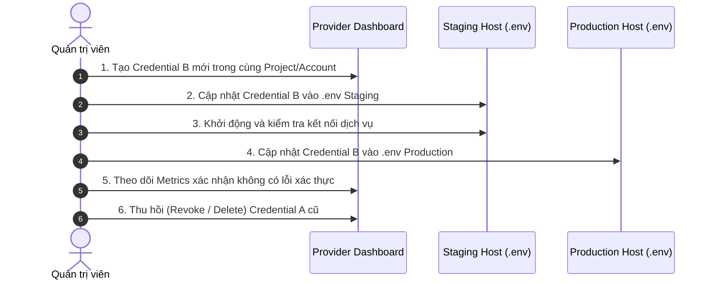

# BÁO CÁO KIỂM KÊ SECRET, KẾ HOẠCH ROTATION & PHƯƠNG ÁN CHUẨN HÓA GIT
**Dự án**: HUIT Chatbot (`D:\chatbot2`)  
**Ngày thực hiện**: 16/09/2026  
**Kỹ sư thực hiện**: Principal Security Engineer & Release Architect  

---

## 1. TỔNG QUAN KIỂM TRA CHỈ ĐỌC BAN ĐẦU (READ-ONLY BASELINE AUDIT)

- **Nhánh hiện tại**: `main`
- **HEAD Commit**: `70c61277b39a4faf0946d20fc780fc6bf23feaae`
  - Tác giả: `nguyenkhaihiep1999-beep <nguyenkhaihiep1999@gmail.com>`
  - Nội dung commit message: `feat(admin): cai thien bao mat trang admin yeu cau tai khoan khaihiep va mat khau 123` *(Chứa thông tin nhạy cảm lộ rõ trong commit log)*
- **Remote Origin**: `https://github.com/nguyenkhaihiep1999-beep/huit-chatbot.git`
- **Remote State**: `70c61277b39a4faf0946d20fc780fc6bf23feaae refs/heads/main` (Trùng khớp 100% với local HEAD)
- **Thống kê Working Tree**:
  - Tracked Modified: `3` files (`.gitignore`, `requirements.txt`, `vercel.json`)
  - Tracked Deleted: `216` files (Nguyên mẫu cũ trong `huit_chatbot_handoff/`, `huit_chatbot_handoff (2)/`, `schema 2 (1).json`)
  - Untracked Files: Kiến trúc mới `backend/`, `frontend/`, `scripts/`, `docs/`, `deploy/`, configs
  - Ignored Sensitive Files: `backend/.env` được bảo vệ nghiêm ngặt bởi `.gitignore` (`backend/.env`)

---

## 2. BẢNG KIỂM KÊ SECRET THEO MÃ NỘI BỘ (INTERNAL SECRET INVENTORY)

> [!CAUTION]
> **Tuân thủ quy chuẩn bảo mật**: Tuyệt đối không hiển thị giá trị secret hoặc fingerprint chi tiết (không in ký tự đầu/cuối). Toàn bộ được định danh bằng mã nội bộ `SECRET-xxx`.

| Mã ID | Nhà cung cấp / Loại Secret | Phạm vi xuất hiện | Phân Loại Rủi Ro | Trạng Thái / Hành Động |
| :---: | :--- | :--- | :---: | :--- |
| `SECRET-001` | **MongoDB Atlas Connection URI & User Pass** | Git History (`d8028f8` $\rightarrow$ `9928ab3`) | **P0 - Critical** | **Bắt buộc Rotate / Revoke**: Từng tồn tại trong Git history |
| `SECRET-002` | **Admin Plaintext Password** | Commit message `70c6127` & `backend/.env` | **P0 - Critical** | **Bắt buộc Rotate**: Lộ trong commit message HEAD & working tree |
| `SECRET-003` | **Groq API Key** | Git commit `362eab6` & `backend/.env` | **P0 - Critical** | **Bắt buộc Rotate / Revoke**: Từng tồn tại trong Git history & working tree |
| `SECRET-004` | **OpenRouter API Key** | Git commit `d8028f8`, `0218e33` & `backend/.env` | **P0 - Critical** | **Bắt buộc Rotate / Revoke**: Từng tồn tại trong Git history & working tree |
| `SECRET-005` | **Admin Token / HMAC Secret** | Git commit `0218e33`, `b6bb6ad` & `backend/.env` | **P0 - Critical** | **Bắt buộc Rotate**: Cần sinh HMAC token mới cho staging/prod |
| `SECRET-006` | **Kaggle API Token** | Git commit `d8028f8` (`push_kaggle_notebook.py`) | **P1 - High** | **Bắt buộc Rotate / Revoke**: Từng xuất hiện trong Git history |
| `SECRET-007` | **Gemini / Google AI API Key** | Mẫu hướng dẫn trong commit `0218e33` | **P2 - Review** | **Cần kiểm tra / review**: Rà soát usage trên AI Studio |
| `SECRET-008` | **Object Storage Credentials** | Khai báo tham chiếu (`config.py`, `storage_adapter.py`) | **P2 - Review** | **Cần kiểm tra / review**: Cấu hình S3/R2 khi lên staging |
| `SECRET-009` | **GitHub / Vercel Token** | Mock test parameters trong test suite | **P2 - Review** | **Cần kiểm tra / review**: Xác nhận không rò rỉ token thật |
| `SECRET-010` | **Docker Internal URI & Env Placeholders**| `docker-compose.yml`, `.env.example` | **No Action** | Mẫu biến môi trường / mạng nội bộ Docker |

---

## 3. CHECKLIST KIỂM TRA TRÊN DASHBOARD NHÀ CUNG CẤP (DÀNH CHO NGƯỜI DÙNG)

Trước khi kích hoạt quy trình xoay vòng (Rotate), người dùng cần trực tiếp thao tác kiểm tra trên trang quản trị các dịch vụ:

### 3.1. MongoDB Atlas Dashboard (`cloud.mongodb.com`)
1. Truy cập **Security** $\rightarrow$ **Database Access**:
   - Kiểm tra các Database User hiện có.
   - Xem thời gian kết nối gần nhất (*Last Authenticated*).
   - Quyền hạn: Giới hạn `readWrite` duy nhất trên database `huit_chatbot`.
2. Truy cập **Security** $\rightarrow$ **Network Access**:
   - Kiểm tra IP Access List (tránh để `0.0.0.0/0` không có kiểm soát).

### 3.2. Groq Console (`console.groq.com/keys`)
1. Kiểm tra danh sách API Keys:
   - Thời điểm gọi API gần nhất (*Last Used*).
   - Lượng token tiêu thụ trong 7 ngày qua (*Usage History*).
   - Thu hồi (Revoke/Delete) key cũ đã bị phát hiện trong Git history.

### 3.3. OpenRouter Dashboard (`openrouter.ai/keys`)
1. Kiểm tra danh sách API Keys:
   - Hạn mức tín dụng khả dụng (*Credit Limit*).
   - Nhật ký request (*Activity Log*).
   - Thu hồi (Revoke/Delete) key cũ đã từng xuất hiện trong commit cũ.

### 3.4. Google AI Studio (`aistudio.google.com/app/apikey`)
1. Kiểm tra danh sách API keys:
   - Rà soát các key liên kết với dự án Google Cloud.
   - Áp dụng Application Restrictions (HTTP Referrer / IP).

### 3.5. GitHub & Vercel Dashboard
1. Rà soát Personal Access Tokens trên GitHub Settings.
2. Kiểm tra Environment Variables trên dự án Vercel.

---

## 4. QUY TRÌNH ROLLING ROTATION KHÔNG DOWNTIME (ZERO-DOWNTIME ROTATION)

---

## 5. PHƯƠNG ÁN CHUẨN HÓA GIT REPOSITORY (PHASE P0-B)

| Tiêu chí | Phương Án A: Tạo Repository Private Sạch Mới (Clean Slate) | Phương Án B: Rewrite History bằng `git-filter-repo` / BFG |
| :--- | :--- | :--- |
| **Cách làm** | Khởi tạo repo sạch từ snapshot hiện tại (kiến trúc chuẩn đã loại trừ hoàn toàn code cũ). Tạo 1 baseline commit đầu tiên. | Dùng script rewrite toàn bộ commits cũ, xóa thư mục prototype cũ, redact chuỗi mật khẩu trong commit `70c6127`. |
| **Xử lý Secret trong History** | **Tuyệt đối an toàn 100%**: Không còn bất kỳ commit cũ hay blob rác nào tồn tại. | Rủi ro cao: GitHub backend vẫn lưu reflog cache / dangling commits nếu không liên hệ GitHub Support để GC sạch. |
| **Dung lượng Repo** | Siêu nhẹ (< **5 MB**), clone chỉ mất 1-2 giây. | Trung bình (~**25-30 MB**) do các packfile lịch sử cũ. |
| **Ảnh hưởng đến Remote** | Đẩy lên repository private mới (hoặc force push đè lên repo hiện tại sau khi người dùng backup). | Bắt buộc phải Force-push (`git push --force`), làm hỏng SHA hash của mọi bản clone cũ. |
| **Lịch sử Commit** | Bắt đầu lịch sử commit chuẩn mực, thông điệp rõ ràng theo Conventional Commits. | Giữ lại các commit cũ dạng chắp vá/thử nghiệm ban đầu. |
| **Mức độ phức tạp** | Rất đơn giản, không rủi ro làm hỏng cây thư mục Git. | Phức tạp, đòi hỏi cài đặt công cụ bên ngoài (`git-filter-repo`). |
| **Khuyến nghị của Kỹ sư** | ⭐ **KHUYẾN NGHỊ LỰA CHỌN (RECOMMENDED)** | Chỉ dùng nếu bắt buộc giữ timestamp của các commit nháp cũ. |

---

## 6. PHÁN QUYẾT & CỔNG NGHIỆM THU PHASE P0

- **Phase P0-A (Kiểm kê Secret)**: **HOLD** — Đang chờ người dùng kiểm tra và xác nhận hoàn tất xoay vòng (rotate/revoke) bí mật trên các dashboard dịch vụ.
- **Phase P0-B (Làm sạch Git)**: **HOLD / CHƯA THỰC HIỆN TRONG PHIÊN NÀY** — Chờ P0-A hoàn tất và người dùng lựa chọn phương án.
- **Phase P1 $\rightarrow$ P3**: **CHƯA TRIỂN KHAI** — Nghiêm cấm chuyển sang P1/P2/P3 khi P0 chưa hoàn thành.
